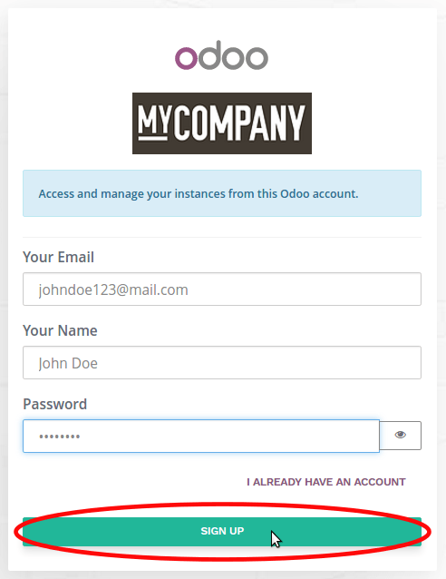
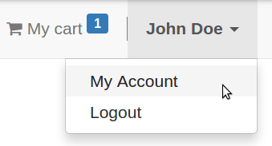
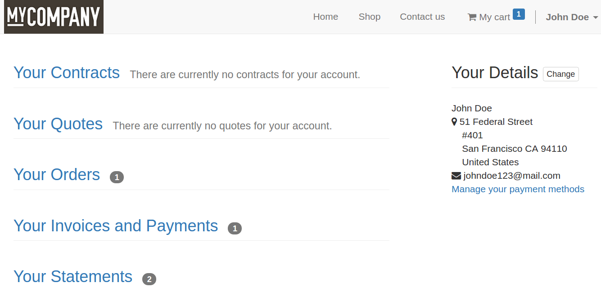

==========================================
How customers can access their portal
==========================================

It has never been so easy for your customers to access their documents
through a portal. Forget endless signup forms, Odoo makes it as easy as
ABC. With eCommerce and Online Quotation apps, your customers are requested
to create a portal account (name, email, password only) from the very first
order confirmation or online quotation email they get from you.

Sign up
=======

When clicking the link in the email or when clicking *Sign up* in the checkout
process, your customer is directed to the *Sign up* page.

Customer account
================

Once logged in the customer will access his account by clicking *My Account*
in the login dropdown menu.

From the portal menu all the customer history can be reviewed. The main address
(billing) can also be modified.

.. note::
    If a portal user is a contact of a company (*Company* field set in customer
    detail form), this last will see all the documents of the company and all
    its other contacts through the portal.
