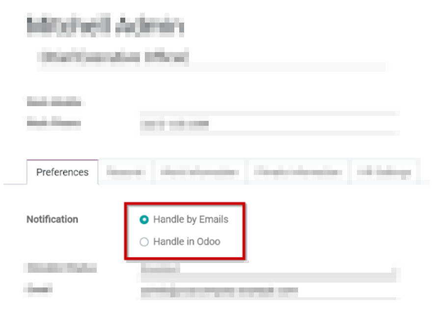
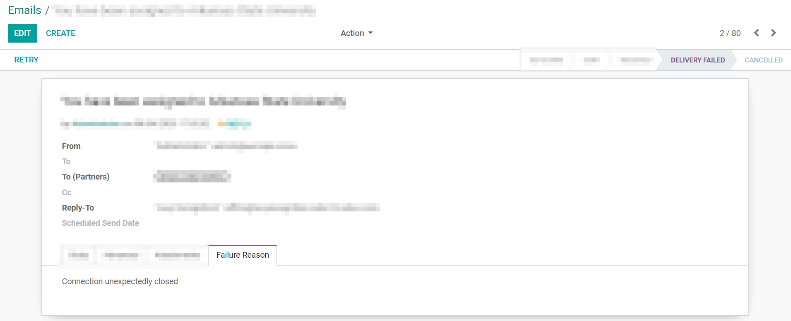
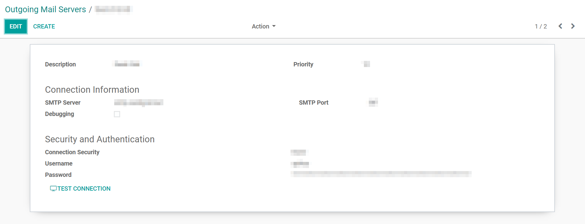

==============================
How to solve issue with emails
==============================

Here is a list of non exhaustive reason that can explain why your emails have not been sent:

You reached your daily limit
============================

Odoo is limitating the number of emails that can be sent daily, by default:

- 200 for the SaaS database and our Cloud Platform Odoo.sh,
- 50 for the trials. 

As a solution, you can either ask the support to increase your daily limit (depending on few parameters it will or not be accepted).
Or use your own outgoing email server which has less restrictions and will be more configurable according to your needs. 

Consider reading our documentation regarding the configuration of the outgoing email servers:
    * :doc:`../../email_communication/advanced/email_servers`

It's interesting to note that the counter is the same for all the database and it can increase very quickly.
For example, if a customer responds on an invoice to which 10 people are followers (internal users, other employees of the same customer, etc.), 
a copy of his message is automatically redirected to 10 people, generating 10 outgoing emails. 

If you wish to receive your emails in Odoo, there is a setting that can be set on your profile:
go in your profile (by clicking on your user on the top right of the screen) and click on preferences and choose to handle notifications within Odoo and not by emails.

The envelop is red in the chatter
=================================

As a first step of investigation it might be interesting to check if you have no SMTP error message. 
To do so, you can go to :menuselection:`Settings --> Technical --> Emails`.

Click on a red email and select the tab `Failure Reason`.

Sometimes, Odoo is not capable of providing the error message. To get more information, you should check with the administrator of the email server or contact the Odoo Support.

.. note::
   To enable the developper mode and see the Technical menu, please see the following explanation
   :doc:`../../../general/developer_mode/activate`

My outgoing email server is not properly configured
===================================================

If you choose to use your own email server, you will have to set it up.
It may happen that some errors occur in the setup. To check it, go in :menuselection:`Settings --> Technical --> Outgoing Mail Server`.

Emails providers might have their own limitation, here is a few example of existing ones:

- Gmail accounts have a limitation of 500 mails per day.
- Yahoo is not working properly with Odoo as they defined a blocking DMARC policy few years ago that is not compatible with the way Odoo is working.
- Office 365 email servers don't allow easily to send external emails from hosts like Odoo.
    Refer to the `Microsoft's documentation <https://support.office.com/en-us/article/How-to-set-up-a-multifunction-device-or-application-to-send-email-using-Office-365-69f58e99-c550-4274-ad18-c805d654b4c4>`
    to make it work.

.. note::
   Please find more information on our page regarding outgoing emails servers:
   :doc: `../advanced/email_servers`

My email is not going out and there is a red envelop
====================================================

It might happen that some emails are not going out properly and Odoo has no power on this.
For diverses reason, during the transit of the email, an error occurs and a bounce email is sent back to the sender to letting him know that it didn't reach its destination.

In case the email is sent using Odoo, the bounce email should reach the Odoo database and display a red envelop. To be able to investigate, please refer to the subsection `The envelop is red in the chatter` 

For now, Odoo is not always capable of providing the information on the reason it failed.
The technology of the mails is old and extensible, the different providers implement a personalized policy of the mails. 