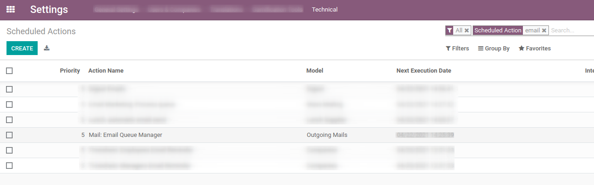
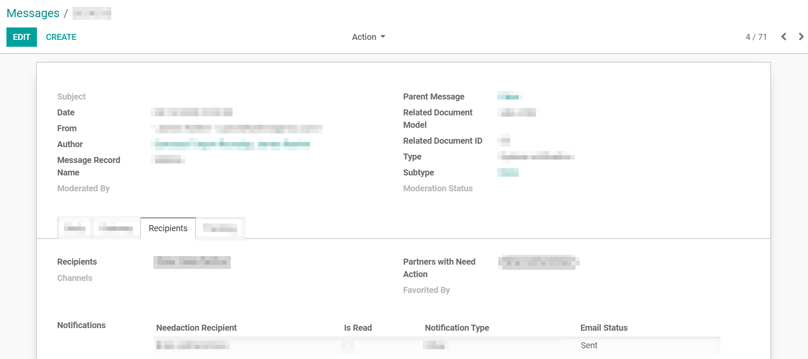
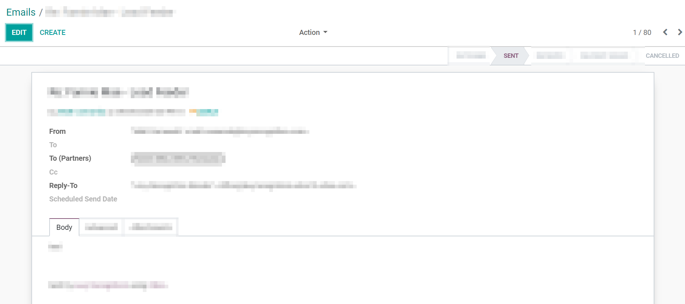

=================================================
Troubleshooting issues related to outgoing emails
=================================================

*"Why wasn't my email sent?"*

Here is a list of the most common reasons that can explain it.

You reached your daily limit
============================

.. warning:
    Applies to Odoo Online and Odoo.sh platforms only.

Odoo caps the number of emails that can be sent every day, to keep the database and mail servers safe and to prevent the spam.

Here are the default limits for new databases:

- 200 emails/day for Odoo Online and Odoo.sh databases with an active subscription,
- 50 emails/day for one-app free and trial databases.

// TODO RIM pas clair

In case you hit the limit, you can:

// TODO RIM lien vers le support form
- either ask our support team to increase your daily limit (we will analyze your
  situation: how many users in your database, which apps, how much traffic...).
  You can contact the support by the following `link <https://www.odoo.com/help>`

- either use your own outgoing email server: you can do (nearly) whatever you want, it's your server!
  In that case, here is our documentation about how to configure it:
      * :doc:`../../email_communication/advanced/email_servers`

**Beware: the counter is global to your database and can rise quite fast!**
For example: if a customer replies to an invoice followed by 10 people (internal users, other contacts for the same customer, etc.),
a copy of their message is automatically sent to these 10 people,
generating 10 outgoing emails.

You can mitigate this by **receiving your notifications in Odoo Discuss**.
Go to "My Profile" (click on your user on the top right corner of the screen),
then pick the "Preferences" tab and choose "Handle notifications within Odoo" (not by email).

.. image:: media/user_pref_handle_notifications.png
   :align: center
   :alt: user preferences handle notifications.

"The envelop is red"
====================

// TODO RIM screenshot red envelop + click on it

If your email wasn't delivered, Odoo might have recorded the SMTP error explaining why.
The menu :menuselection:`Settings --> Technical --> Emails` displays the whole email queue,
including emails that could not be sent..

Click on an email marked in red and select the tab `Failure Reason`.

.. image:: media/failure_reason.png
   :align: center
   :alt: failure reason email tab and explanations.

If Odoo was not able of providing you with an error message, you should ask the administrator
of the email server to have a look at the log files of the Odoo server and the SMTP server
(or contact the Odoo Support if you are hosted on one of our cloud platforms).

.. note::
   The "Technical" menu is visible in Deveoper mode only, see
   :doc:`../../../general/developer_mode/activate`

Your outgoing email server is not properly configured
=====================================================

If made the choice to to use your own email server, you have to set it up.
An incorrect setup may prevent the delivery of your emails.

In order to check your outgoing mail settings, go to :menuselection:`Settings --> Technical --> Outgoing Mail Server`.

.. image:: media/setting_outgoing_mail_server.png
   :align: center
   :alt: setting up an outgoing email server.

If you use a well-known email provider like Gmail or Office 365, you have to comply to its limitations, e.g:

- **Gmail** accounts cannot send more than 500 emails a day. // TODO RIM ref?
- **Office 365** email servers don't allow easily to send external emails from hosts like Odoo.
    Refer to `Microsoft's documentation <https://support.office.com/en-us/article/How-to-set-up-a-multifunction-device-or-application-to-send-email-using-Office-365-69f58e99-c550-4274-ad18-c805d654b4c4>`
    to make it work.
- Yahoo is not working properly with Odoo as they enforce a strict DMARC policy that is not compatible with Odoo at the moment.

.. note::
   For more advanced information regarding outgoing emails servers, see:
   :doc: `../advanced/email_servers`

Emails went out of Odoo but you still see a red envelop
=======================================================

// TODO RIM merge with section "envelop is red"

It might happen that some emails are not going out properly and Odoo has no power on this.
For diverses reason, during the transit of the email, an error occurs and a bounce email is sent back to the sender to letting him know that it didn't reach its destination.

In case the email is sent using the Odoo, the bounce email should reach the Odoo database and display a red envelop. To be able to investigate, please refer to the subsection `The envelop is red in the chatter`

For now, Odoo is not always capable of providing the information on the reason it failed.
The technology of the mails is old and extensible, the different providers implement a personalized policy of the mails.   

Emails are going out but there is a delay
=========================================

We prioritize differently emails going out from Odoo, some needs to be direct and some might be delayed:
When you schedule a mailing campaign using our email marketing application, the emails are depending on a scheduled action (action to trigger at a specific moment)

It may happen that you schedule some Mailing campaign but it is not sent at the precise time. 

This happens for example with Mailing Campaign, the emails you send directly from a Sales Order, quotation.. are sent directly. We use that policy in order to avoid cluttering the mail servers and prioritize the communication. 
In the case of a mailing campaign using our app, you will see a banneer on the campaign mentioning when the emails will be sent.
You can see the emails in the queue by going on the General Settings, Technical menu (in debug mode), emails. The one with the subject of your mailing campaign and being in the state ' sending '.
You can also send them directly by going in the Scheduled action menu under: General Settings, Technical menu (in debug mode). Selecting the action 'Mass Mailing: Process Queue' and forcing it 

.. Screenshot is missing!

Messages vs Emails in Odoo
==========================

We use 2 types of written notifications, the messages and the emails. If they could contain the same information, they have different purposed:
- The messages are using to be display in the chatter. The model is 'mail.message' containing a minimum of information to be displayed on the correct thread and record.
   They can be found on the General Settings, Technical menu (in debug mode), messages

- The emails are the equivalent of the one received in the mailbox, with all the information that might not be useful in Odoo. To save space and preserve the performance, once emails are sent they are removed from the database.
It's possible to specify that some emails are not being deleted upon sending. They can be found on the General Settings, Technical menu (in debug mode), emails

.. Screnshots are ok!

Entering emails issue: emails are not received
==============================================

Depending on the platform you are using: 
 - The Odoo.sh users can find they logs on the folder ~/logs/. The log file are created everyday at 4:00 UTC time. The two last days are not zipped, where the older are zipped in order to gain space.
   The naming of the files are decremental, which means that the file named .1 is the one from yesterday and the file .2 is the day before yesterday.

 - The SaaS users won't have access to their logs. However you can still submit a ticket to know the reason why a specific email has not being received. 
 Most of the time, we do not investigate unless it is recurring but if you notice that the issue happens all the time with the same client, do not hesitate to contact us with all the necessary information.

In order to get helped efficiently, please provide as much information as possible. Here is a list of what can be helpful:
* the EML of the file, stating for ' Electronic Mail ', this is the email with all the technical information.

   Here is how to find it:
   In Gmail:
      1/ Click on the email you are expected to find in Odoo:
      .. image:: media/mail_gmail_side_functional.png
         :align: center
         :alt: A gmail mail that is expected to be received in Odoo.

      2/ On the 3 dots 'settings' of the email, click on show original > Download Original after the header.
      .. image:: media/mail_gmail_side_technical.png
         :align: center
         :alt: A gmail EML expected to be received in Odoo.

   In Outlook:
      1/ Click on the email you are expected to find in Odoo:
      .. image:: media/mail_outlook_side_functional.png
         :align: center
         :alt: An outlook mail that is expected to be received in Odoo.

      2/ On the 3 dots 'settings' of the email, click on View > Message source.
         You will have to copy/paste in your favourite text editor 
      .. image:: media/mail_outlook_side_technical.png
         :align: center
         :alt: An outlook EML expected to be received in Odoo.

.. Screnshots are ok!

   The documentation of your own provider might help you on how to get your EML files.

   Once you get the EML of the email, adding it in attachment of your ticket is the most efficient way for us to investigate. The support will mainly focus on redundant issues.

* The exactly flow you are doing in order to normally receive those email in Odoo. Is this simply a reply from an email going out from Odoo ? Are you using an incoming email server or are your forwarding somehow those emails?
   Can you provide us with an example of an email that has been correctly forwarded ?

* Have you also tested the basic flow of your database? Is is working as expected?
