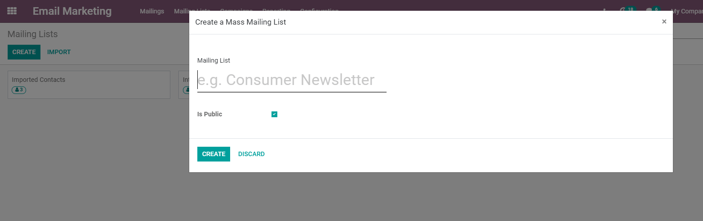
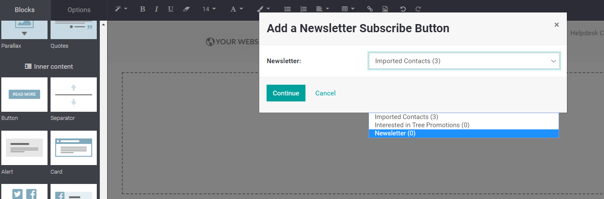
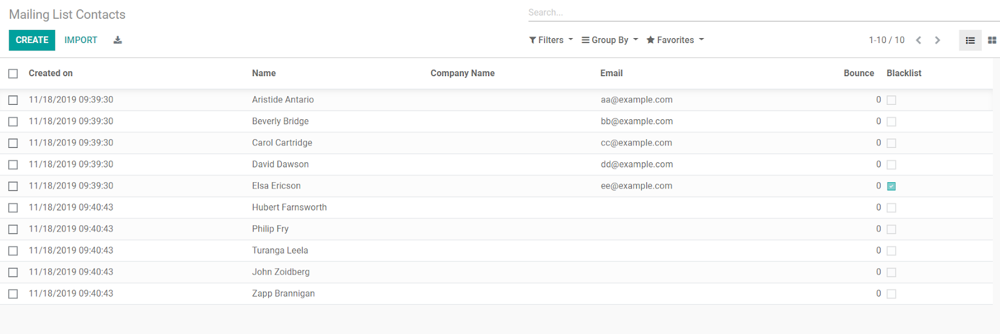
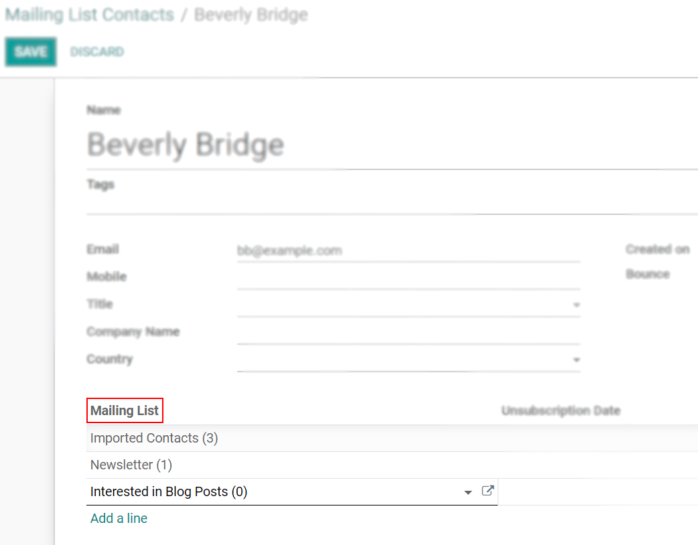

=======================
Work with Mailing Lists
=======================
Mailing lists could be a goldmine for your company’s marketing department as they can provide leads
for sales, focus groups for testing new products, and consumers to provide feedback on satisfaction,
for example.

Create Mailing lists
=====================
Go to :menuselection:`Mailing lists --> Mailing lists --> Create`.
Enable the option *Is Public* to make the list visible for users when unsubscribing.

Once your mailing list is created, you can manually add contacts clicking on *Create*.
*Import* a list of contacts if you have it from a previous tool.

Linking a mailing list to my website
-------------------------------------
Create a mailing list called Newsletter, as you use this strategy to advertise and communicate new
ideas to subscribers interested in listening.
Go to your *Website*, add a *Newsletter* block and choose the respective mailing list.

Check all the contacts of your mailing list(s)
----------------------------------------------
Under :menuselection:`Mailing Lists --> Mailing List Contacts` see a list of all contacts under all
your mailing lists, and the ones you individually created here.

Open a contact to see or add different mailing lists to which the contact is or will be part of.

.. seealso::
   :doc:`../email_marketing/send_emails`
