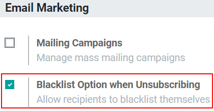
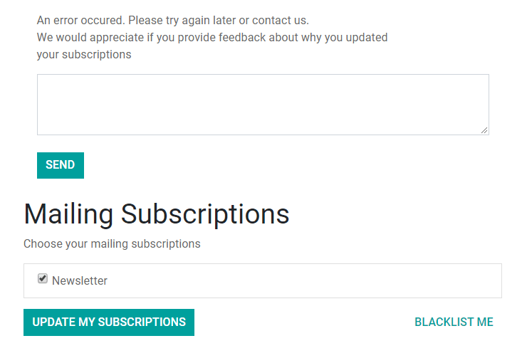
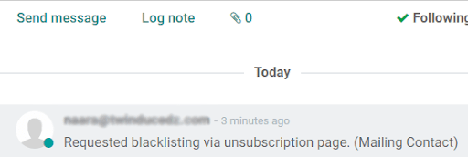

====================================
Manage Unsubscriptions and Blacklist
====================================
It is best practice and legally required to allow recipients to manage their state via the
unsubscription page, as you do not want your audience to think that your company is using any
tactics that are dishonest or spammy.

Enable the Blacklist feature
=============================
Go to :menuselection:`Configuration --> Settings` and enable the option *Blacklist Option when
unsubscribing*.

Now, once the user clicks on the *Unsubscribe* link on your email, he will be redirected to the
following page:

In addition to having the option of unsubscribing from specific mailing lists, the user can also
blacklist himself, meaning that he will not receive *any* more emails.

.. note::
   The mailing list has to be configured as *Public* in order to be visible for users.

Under :menuselection:`Configuration --> Blacklist`, blacklisted email addresses will be shown.
When opening the record, as a *Log note*, a description-history is kept.

