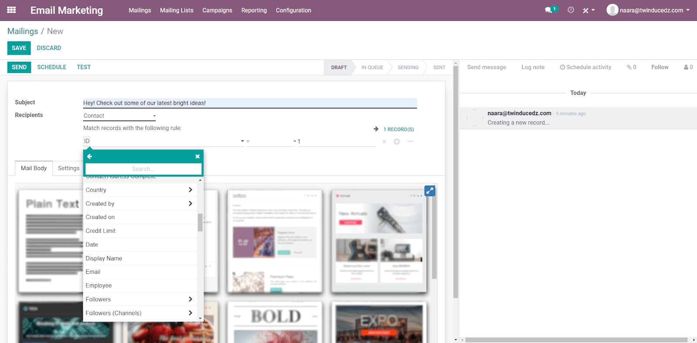
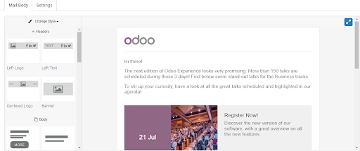
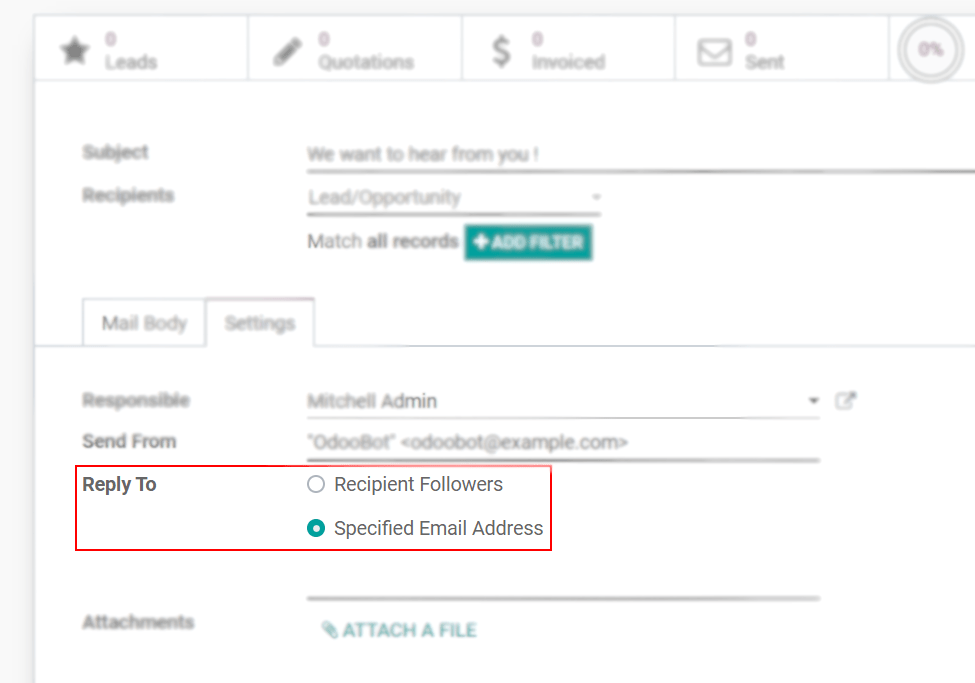
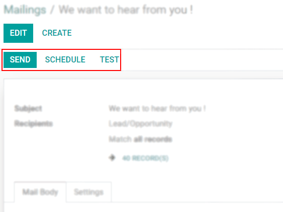
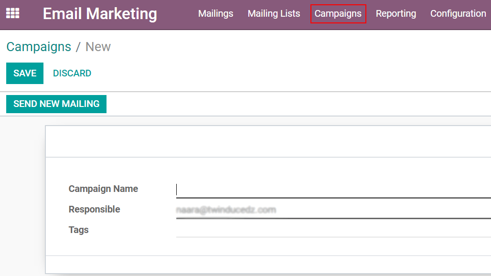

===========================================
Send Emails Marketing and Manage Campaigns
===========================================
Emails allow you to effectively, and at a low cost, reach a large number of consumers while being
able to customize your message in a way that resonates with them. It is measurable, and a
call-to-action oriented channel.

Choose the right target and create the message
===============================================
Go to :menuselection:`Mailings --> Create`.
Choosing *Contacts*, for example, as *Recipients*, will allow you to add specifications to match
just certain contacts, filtering your target.

.. note::
   Trial databases have the benefit of 50 emails to be sent per day; when on Odoo SH Cloud
   Platform the limit is 200. There is a possibility to increase these numbers by contacting Odoo
   Support. To contact Support, `click here <https://www.odoo.com/help>`_.

Under *Mail Body*, choose a layout and make the modifications needed dragging, dropping and
double-clicking on content. Note that it is possible to start from scratch selecting the *blanc*
template option.

Under *Settings*, you can designate someone else as the responsible sender if not you and change the
email address used as the sender (*Send From*).
With the *Reply To* radio button, you can also choose to gather answers either on the respective
recipients’ records or on a specific email address. Note that this option is not available if you
target mailing contacts, a mailing list or contacts as recipients.

Test, send or schedule a mailing
=================================

*Save*: the work will be allocated in the *draft* column in the kanban view. Modifications can be
made while being in this stage. The option *Discard* will delete the email.

Click on *Test* and send your message to one, or even multiple, test contacts to avoid errors.

*Send* will trigger the email with the next run and put the work on the *queue* column in the
kanban view.

*Schedule* allows you to choose a date and time and will put the email in the *queue* column in the
kanban view.

.. note::
   The daily limit is applied for *all emails* sent, in other words, throughout all applications.
   Therefore, if at the end of the day you have remaining ones to be sent, note that they *will not*
   be sent automatically the next day. You will need to force that triggering opening the email and
   clicking on *Retry*.

Manage campaigns
=================
Go to :menuselection:`Configuration --> Settings` and enable *Mailing Campaigns*.
The campaign option is effective as it allows you to organize your marketing efforts and have a
centralized view of its metrics.
Go to *Campaign* and click on *Create* to start one.

.. note::
   If you use the SMS and Social Marketing applications, as well as the Push Notification feature,
   you will see the option to create content for those channels. You will also see the *Campaign*
   menu within those applications. All of this is possible because the applications work integrated.

.. seealso::
   `How to use my mail server to send and receive emails in Odoo <https://www.odoo.com/documentation/user/13.0/discuss/email_servers.html?highlight=marketing%20automation>`_

