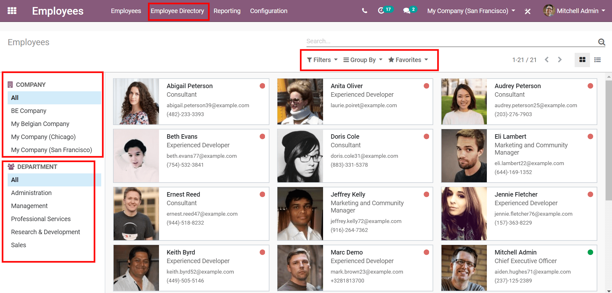
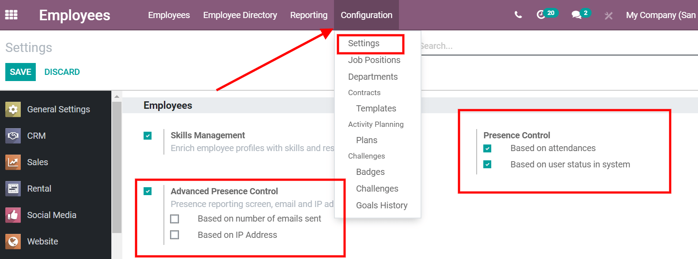
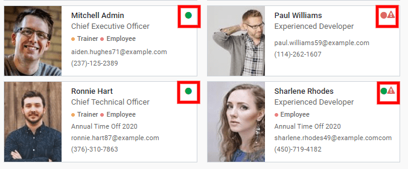

==================
Employee Directory
==================

The Employee Directory allows you to manage all the employees in your Database. From the Directory, you can complete all
the employee's form, create departments and organize your company’s structure...

Using the Employee Directory
============================

From the *Employee Directory*, filter your employees by *Company*, *Department*, *Manager* or simply use the search bar
to find a specific employee.

.. tip::
   You can search for old employees by setting the filter to “Archived”.

Employee Presence
=================

Manage online presence tools to help better report employee attendance and take actions for employees who are not
present by sending a sms / e-mail reminder / putting a one day leave. Different online presence methods can be set up in the
settings.

Go to :menuselection:`Employee --> Configuration --> Settings`

Pick the best method to track employee presence by criteria that fit your company.

Presence Control
----------------
Presence control can be achieved through 4 different methods. You can pick the one that suits your company the most, if
two or more presence control methods are active. Once a user has filled in the requirements for one method he will be
displayed as present.

Based on attendance: The user is considered *at work* if they're identified in the app **Attendances**. The App
allows each employee to simply *check in* and *check out* with a simple click in the *Database*. With **Attendances**
You can also set up a kiosk were employees could check in and out with a personal pin number or badge you can generate
from each employee form. With this method the exact attendance time for each employee will be recorded in Odoo.

Based on user status in the system: The user is considered *at work* if he is logged in to your database. This user
stays active as long as he’s connected to the database and for a period of 30 min after he disconnects.

Advanced Presence Control
-------------------------

*Based on number of emails sent*: define a number of emails to send for the user to be considered present. Once the user
has reached the number of emails he’s shown as *present* for the rest of the day. If the user does not reach the email
goal his status will be *absent*.

*Based on IP address*: the user is considered *at work* if they're logged in to the database via a specific IP address.
Every IP address that needs to be checked has to be filled individually in the settings.

Go to :menuselection:`Employee --> Configuration --> Settings --> Based on IP Address`

Employee Status
---------------

The different presence control methods will impact the status of each employee.

- **At work** if a user fits one of the criteria defined in the settings (green dot).
- **Absent** if the user is not at work and no time off has been taken (red dot).
- **Off** if a user is on *time off* or if he's finished with the working hours defined in his calendar.

