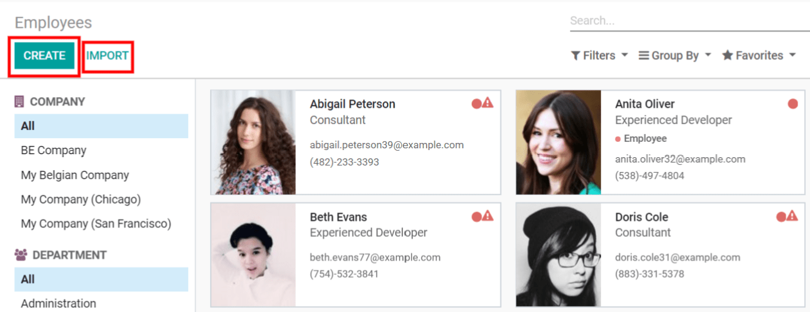
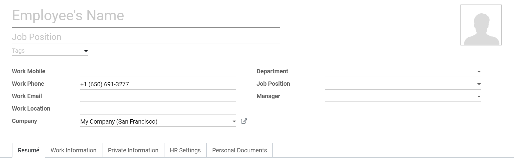
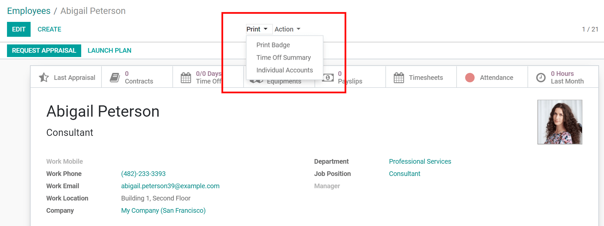
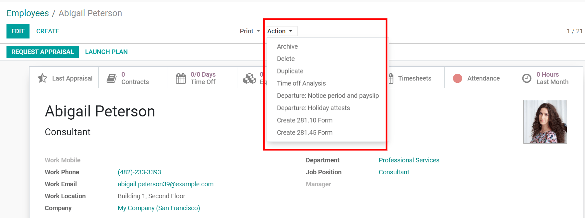
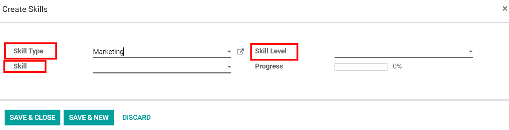
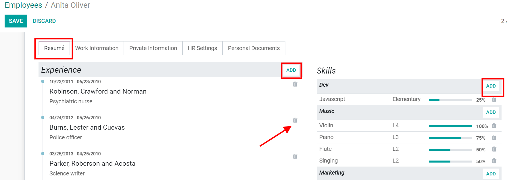
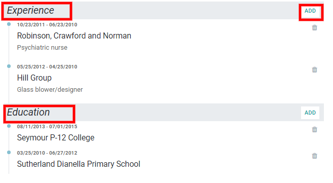
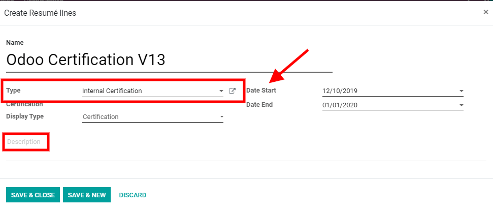
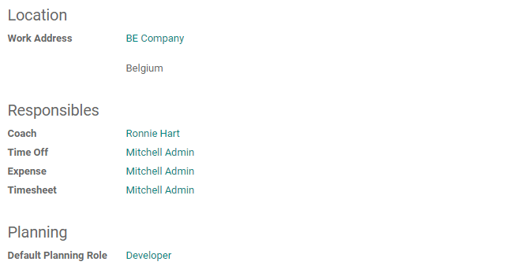
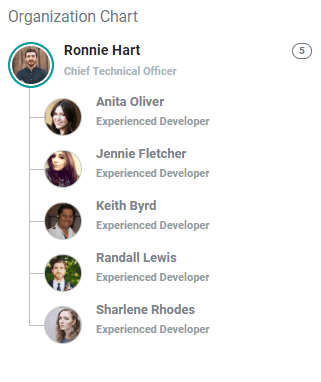

=============
Employee Form
=============

The **Employee Form** allows you to collect all the data and information about your employees they are the core of every
Human Resources application.

Create an employee Form
=======================

You can **Create** an employee from the employee dashboard or directly from a department.

If you have an existing list of employees, you can *Import* them in a CSV or Excel file, to batch import your employees,
use the *Import* button.

.. note::
   Need help? Check `Contacts & Importing data <https://www.odoo.com/slides/slide/contacts-and-importing-data-609?fullscreen=1>`_.

Gathering employee's information
================================

The employee form allows you to add tags, a picture and edit information about your employee.
Departments and managers can always be created or edited on the fly.

Print
=====

From the employee form, *Print Badge* to help you manage attendances, *Time Off Summaries* to have a summary of each
employee time off schedule and *Individual Accounts* each employee's payroll.

.. note::

   *Individual Accounts* are only available in belgian companies

Actions
=======

The actions menus allows you to *Archive*, *Delete*, *Duplicate*, *Generate tax forms* and *Attestations* for you
employee.

.. note::

   281.10 and 281.45 are tax forms for belgian localisations.

Employee Skill management
=========================

Under the *Resumé* tab in the employee form, you can keep track of the experiences and skills of your employees. Create
and edit skills and experience by clicking on *Edit* →  **Add**. Having that information in the employee's form can help
you find which employees has the specific skill needed for a particular task.
You can also simply delete lines by clicking on the bin icon

Add Skills
----------

You can always create new skills that fit your employee's. When creating a **Skill** you can choose the *Skill Type* to
categorize the kind of skill, create specific **Skill levels**, who will determine your employee progress.
Directly create and edit different *Skill Types*, *Skills* and *Skill Levels* from this form.

Add Experience
--------------
The experience and education your employee's have matter and they should be added in the employee form. When adding an
experience, you can create different categories to better show the background of your employees.

**Experiences** and **Certifications** are linked to a start date, this allows you to see when exactly a certification
or a course was completed by your employee's.

.. note::
   Certifications are displayed with a trophy icon next to them.

Work information
----------------

Under the *Work Information* tab, you can assign responsibles for the different other app integrations such as
**Time Off**, **Expense** and **Timesheet**.

Organization chart
------------------

Setting someone as manager in the employee form will generate an organigram, showing the place of the employee in his
team.

Other tabs include
==================

**Private Information** is the place gathering the private information about employees such as their private address,
family information, marital status, emergency contacts...

**HR Settings** with company related information such as their job position, company vehicle, badge ID...

**Personal Documents**, allowing you to upload documents in image file formats for administrative purposes : ID card
copy, driving licence, SIM card copy....

