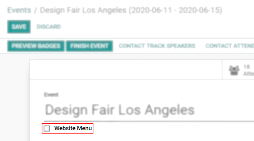
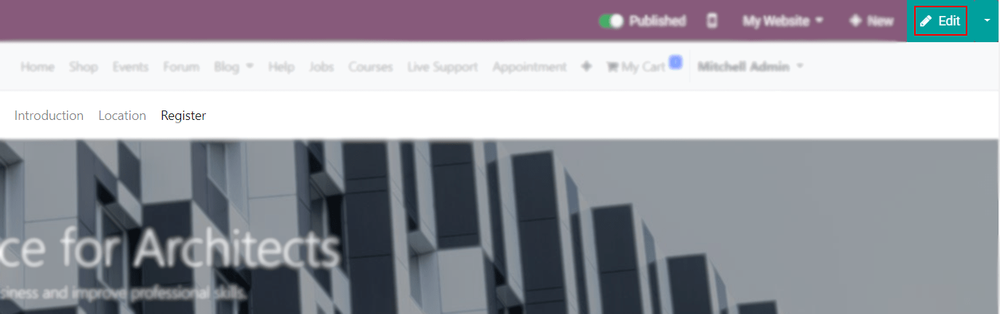
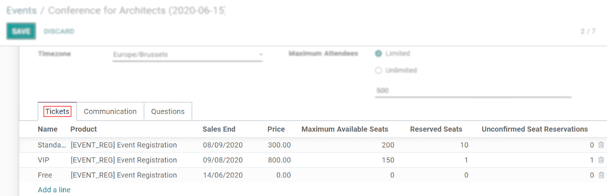

=======================
Create your First Event
=======================

Some of the reasons why hosting events is essential are:

- To create an engaging experience with your audience;
- To generate word of mouth about your company;
- To allow networking;
- To provide an opportunity for sales representatives to walk their prospects through the product
  and even their pipeline.

Get started
===========

Under the menu *Events*, have a view of all existing events and some key information, such as the
number of expected and confirmed attendees.

.. image:: media/events_dashboard.png
   :align: center
   :alt: Overview of events with the kanban view in Odoo Events

To start a new one, click on *Create* and fill in the form with all the needed information. Enable
*Website Menu* to have the menus *Introduction*, *Location*, and *Register* being shown on your
event’s website page.

To personalize these pages, click on *Edit* to open the
`website builder <https://www.odoo.com/slides/slide/website-basics-643?fullscreen=1>`_, and edit
content by dragging and dropping blocks.

Tab: Tickets
------------

| Go to :menuselection:`Events --> Configuration --> Settings` and enable
  :doc:`Tickets and Online Ticketing <tickets>`.
| Now, under the *Tickets* Tab, add lines to include the different ticket types you offer. Include
  the price, the start and end dates for registrations, and even the maximum number of tickets that
  can be sold.
| The *Reserved Seats* and *Unconfirmed Seat Reservations* are counted as attendees are marked as
  :doc:`confirmed <track_attendees>` or not.

Tab: Communication
------------------

| Choose the email and/or SMS message template, as well as the frequency with which you would like
  to communicate with your attendees under the tab *Communication*.
| Create a template on the fly or choose an existing one. Define the *Interval* (2, 7, 15..) for the
  *Unit* (days, hours, weeks, etc.), and the *Trigger* action (after registration, after the event,
  etc.).

.. image:: media/communication_tab.png
   :align: center
   :alt: View of an event form and the tab communication in Odoo Events

Tab: Questions
--------------

| Go to :menuselection:`Configuration --> Settings` and enable *Questions*.
| Now, under the tab *Questions*, edit your questions and answers, choosing if you would like your
  questionnaire to be asked per order or per registration.
| Example of a registration for 3 attendees: if enabling the option *Ask each attendee*,
  the questionnaire is shown 3 times, meaning that answers can vary for each attendee; if *Ask each
  attendee* is not enabled, the questionnaire is shown once, resulting in a global answer.

.. image:: media/questions_tab.png
   :align: center
   :alt: View of an event form and a question’s window opened in Odoo Events

Once your event is *Confirmed*, you can manage attendees badges, and mark the event as
*Finished*. Events marked as *Finished* can be *Set to draft*, putting the event back to an
*Unconfirmed* stage from which it can be edited and used again.

.. image:: media/set_to_draft.png
   :align: center
   :alt: View of an event’s form emphasizing the option set to draft in Odoo Events

Publish your event
------------------

*Go to Website* and turn *Published* on.

.. image:: media/publish_event.png
   :align: center
   :alt: View of a website page and the option to publish the event in Odoo Events

.. seealso::
   - :doc:`track_attendees`
   - :doc:`tickets`
   - :doc:`track_talks`