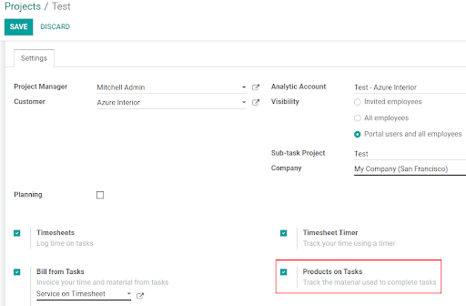
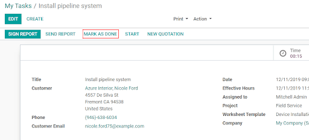

========================
Keeping track of stock
========================
The integration with the Inventory application makes possible to track the material used and
automatically keep your stock up to date.

Set up your Field Service project
==================================
Go to :menuselection:`Field Service --> Configuration --> Projects` and make sure the option
*Products on Tasks* is enabled.

Now, add the materials used in the intervention to the worksheet, and once the task is
*Marked as done*, the stock-picking is automatically validated and the inventory evaluation
is automatically updated.

