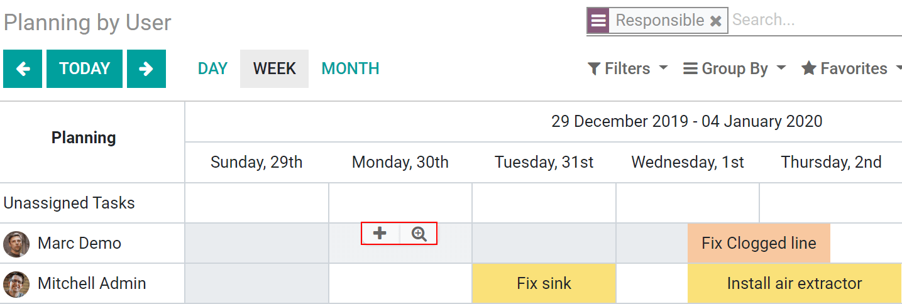

=============================================
Manage your Employees’ Schedules and Time Off
=============================================
The integration with the *Time off* application allows you to quickly see  your employees’
availabilities. It will avoid conflicts and errors between employees schedules and interventions.

Effortlessly see employees’ time off
====================================
No configuration needs to be done.
Once the employees’ time has been validated in the *Time off* application, cells will be grayed for
those days in your Gantt view.

It also adapts to the working calendar of the employee. Example: the employee works part-time
(from Monday to Wednesday). So, Thursday and Friday will also be greyed, in addition to the weekends.

.. image:: media/mw1.png
   :alt: Employees' Time off in Odoo Field Service

Easily manage employees’ schedules
==================================
From the Gantt view (under *Planning by User, Project or Worksheet*), click on the plus sign to add
a new task or on the magnifying glass to plan an existing one.

Unassigned tasks
=================
If you need to plan an intervention but you do not know yet who will take care of it, you can leave
the task unassigned. It will still be shown in the Gantt view. Simply drag and drop the responsible
person he can be assigned.

.. image:: media/mw3.png
   :align: center
   :alt: Unassigned tasks in Odoo Field Service

.. tip::
   Create projects per team, or per working site, and have a more accurate and dynamic database.

.. seealso::
   * :doc:`../../project/overview/setup`
