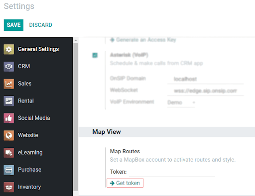
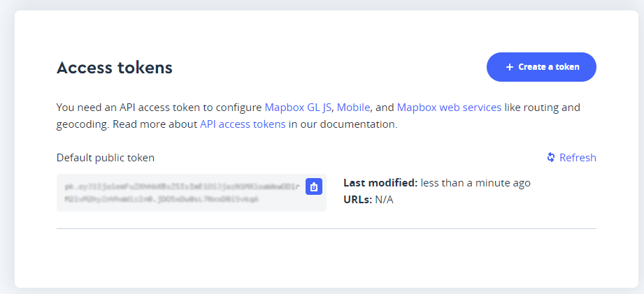
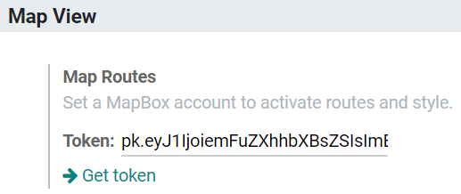
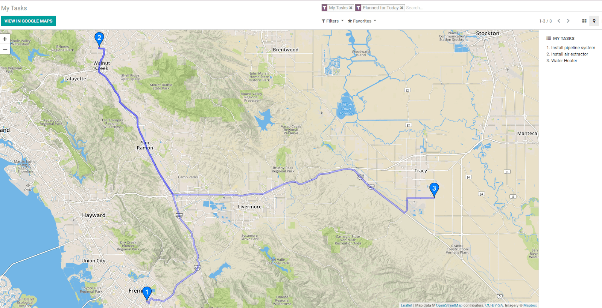

======================
Planning an itinerary
======================

Having an itinerary being shown based on the chronological order of the activities and on the best
route to take, makes employees’ life easier and the workload more efficient.

Have an itinerary displayed directly in Odoo
=============================================
Go to *Settings* and under *Map view* click on *Get token*.

Click on :menuselection:`Start mapping for free --> fill the Username, email and password fields
--> agree with their Terms of Service and Privacy Policy --> Get started`.
You will be redirected to your account. Scrolling the page down you will find *Access tokens*.
Copy the *Default public token.

Back in Odoo, paste it on :menuselection:`Token --> Save`.

Now, your maps will show the itinerary based on the scheduled time and best route.

.. note::
   This is an optional feature, as you can still have access to a map view without a Mapbox account.
