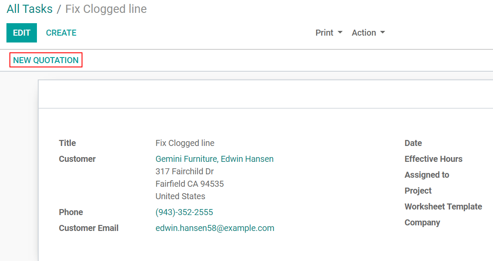

============================
Create Quotations from Tasks
============================
Allowing quotations to be created from tasks delivers a more efficient service as it allows space
for preventive actions, while making the flow easy for employees.

Enable the feature
===================
First, go to :menuselection:`Field Service --> Configuration --> Settings` and enable the option
*Extra Quotations*.

.. image:: media/cq1.png
   :align: center
   :alt: Create quotations in Odoo Field Service

Second, go to :menuselection:`Configuration --> Projects` and enable *Extra Quotations*.

.. image:: media/cq2.png
   :alt: Create quotations in Odoo Field Service

You can now create *New Quotations* directly from your tasks.

