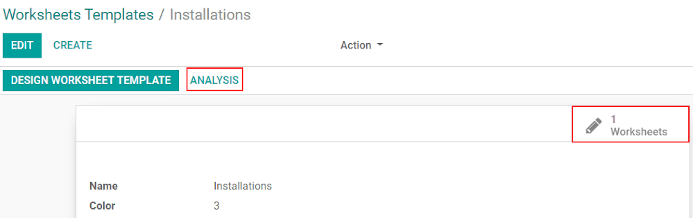

===========================
Customize Worksheet Reports
===========================
Personalizing your customer reports, also called *worksheets*, allows you to have different
descriptions of the work for each type of intervention. It speeds up the flow for your employees
while giving customers a detailed summary, which can be reviewed and signed onsite.

Enable the feature
==================
Go to :menuselection:`Field Service --> Configuration` and enable
:menuselection:`Worksheet Templates --> Save`.

.. image:: media/cc1.png
   :align: center
   :alt: Custom Worksheet in Odoo Field Service

Designing worksheets
====================
Under :menuselection:`Configuration --> Worksheet Templates`, click on *Create* and start to
*Design Worksheet Template*.
You will be redirected to the *Studio* application.

.. image:: media/cc2.png
   :align: center
   :alt: Custom Worksheet in Odoo Field Service

With the freedom of *Studio*, drag and drop fields to create a report tailored to your needs.
Once you are done, click on *Close* and get an overview of the work done.

*Worksheets* is where you can see how many times the worksheet has been used/completed under a task.
*Analysis* examines all the worksheets under that given template and generates a graph.

.. seealso::
   - `Studio Basics <https://www.odoo.com/slides/slide/studio-basics-710?fullscreen=1>`_
