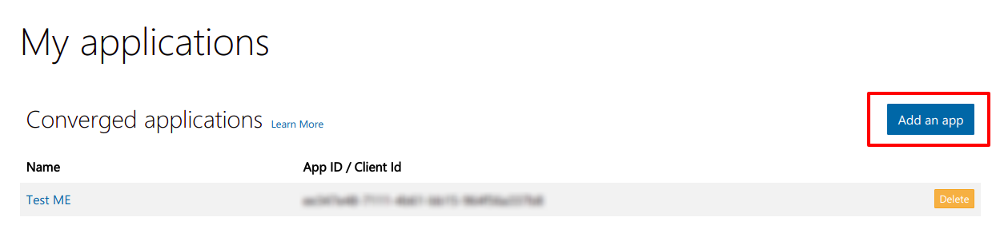
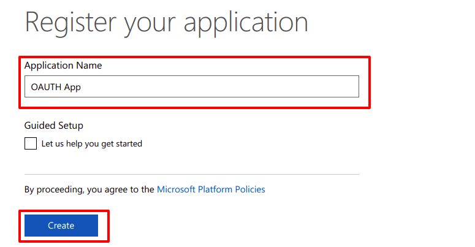
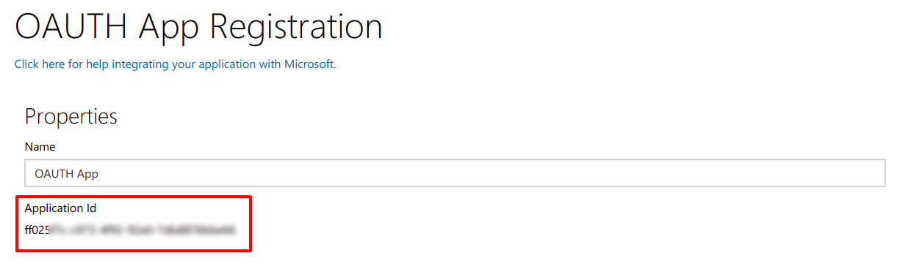
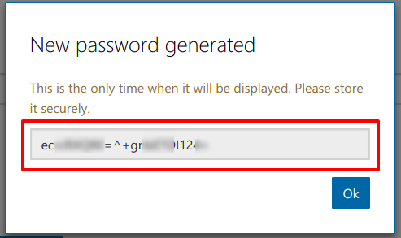
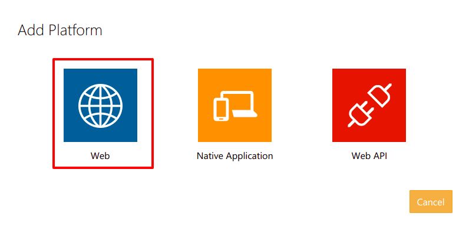
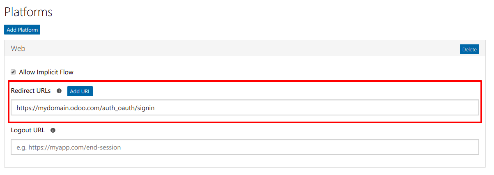

============================================================
How to allow users to sign in with their Microsoft account
============================================================

- Connect to your azure Microsoft and go to `https://apps.dev.microsoft.com/ <https://apps.dev.microsoft.com/>`_.

- Click on **Add an app**.

- Name your new app and click **Create**.

- On the Registration page that follows, copy the **Application Id**. This is your **client_id**.

- Click **Generate New Password**. Copy your password. This is your **client_secret**.

- Click **Add Platform**, then select **Web**.

- Enter the following under **Redirect URLs**. URL: **https://mydomain.odoo.com/auth_oauth/signin** (you can replace 'mydomain.odoo.com' part with your actual domain)

- Click **Save**

- Once done, you receive two information (your Client ID and Client Secret). You have to insert your Client ID and Client Secret in the General Settings.
