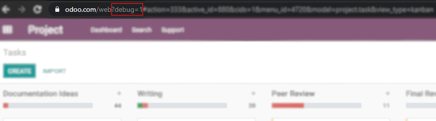

===================================
Activate the Developer (Debug) Mode
===================================

The Developer or Debug Mode gives you access to extra and advanced tools.

Through the Settings application
--------------------------------

Go to :menuselection:`Settings --> Activate the developer mode`.

.. image:: media/settingsdebug.png
   :align: center
   :alt: Overview of the debug options under settings in Odoo

.. note::
   *Activate the developer mode (with assets)* is used by developers; *Activate the developer mode
   (with tests assets)* is used by developers and testers.

Once activated, the *Deactivate the developer mode* option becomes available.

Through a browser extension
---------------------------

| Go to the settings and extensions of your web browser, and search for *Odoo Debug*. Once the
  extension is installed, a new icon will be shown on your toolbar.
| A single click enables a normal version of the mode, while a double click enables it with assets.
| To deactivate it, use a single click.

.. image:: media/monkey.png
   :align: center
   :alt: View of odoo’s debug icon in a chrome’s toolbar

.. tip::
   Developers: type ``?debug=assets`` and activate the mode with assets.

Through the URL
---------------

On the URL add ``?debug=1`` or ``?debug=trueafter`` after *web*.

Locate the mode tools
---------------------

The bug icon, *Open Developer Tools*, can be found on the header of your pages.

.. image:: media/bugicon.png
   :align: center
   :alt: Overview of a console page and the debug icon being shown in Odoo
