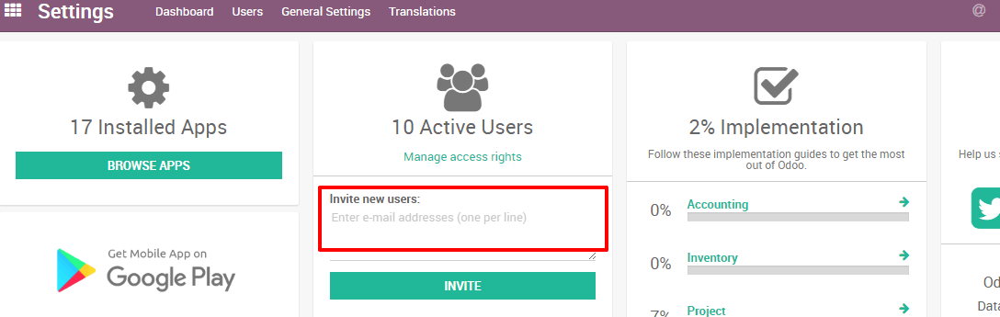

=================
How to add a user
=================

Odoo provides you with the option to add additional users at any given
point.

Add individual users
====================

From the Settings module, go to the submenu :menuselection:`Users --> Users` and click on
**CREATE.** First add the name of your new user and the professional
email address - the one he will use to log into Odoo instance - and a
picture.

.. image:: media/add_user01.png
    :align: center

Under Access Rights, you can choose which applications your user can
access and use. Different levels of rights are available depending on
the app.

When you’re done editing the page and have clicked on **SAVE**, an
invitation email will automatically be sent to the user. The user must
click on it to accept the invitation to your instance and create a
log-in.

.. image:: media/add_user02.png
    :align: center

.. note::
    Remember that each additional user will increase your subscription fees.
    Refer to our `*Pricing page* <https://www.odoo.com/pricing>`__ for more information.

.. tip::
    You can also add a new user on the fly from your dashboard. From the above screenshot,
    enter the email address of the user you would like to add and click on **INVITE**.
    The user will receive an email invite containing a link to set his password. You
    will then be able to define his accesses rights under the :menuselection:`Settings --> Users menu`.

.. seealso::
    * `Deactivating Users <../../db_management/documentation.html#deactivating-users>`_

.. todo:: Add link to How to add companies
