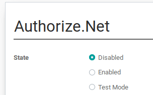

==================================
How to get paid with Authorize.Net
==================================

Authorize.Net is one of the most popular eCommerce payment platforms in North America.
Unlike most of the other payment acquirers compatible with Odoo, 
Authorize.Net can be used as `payment gateway <https://www.authorize.net/solutions/merchantsolutions/pricing/?p=gwo>`__ only.
That way you can use the `payment processor or merchant <https://www.authorize.net/partners/resellerprogram/processorlist/>`__ that you like.

Create an Authorize.Net account
===============================

* Create an `Authorize.Net account <https://www.authorize.net>`__ 
  by clicking 'Get Started'.
* In the pricing page, press *Sign up now* if you want to use Authorize.net as
  both payment gateway and merchant. If you want to use your own merchant, press
  the related option.

  .. image:: media/authorize01.png
    :align: center

* Go through the registration steps. 
* The account is set as a test account by default. You can use this test
  account to process a test transaction from Odoo.
* Once ready, switch to **Production** mode. 

Set up Odoo
===========
* Activate Authorize.Net in Odoo from :menuselection:`Website or Sales or Accounting 
  --> Settings --> Payment Acquirers`.
* Enter both your **Login ID** 
  your **API Transaction Key** and your **API Signature Key**.

  .. image:: media/authorize02.png
    :align: center

  To get those credentials from Authorize.Net, you can follow the direction
  in the Authorize.net Help
  `API Credentials and Keys <https://account.authorize.net/help/Account/Settings/Security_Settings/General_Settings/API_Login_ID_and_Transaction_Key.htm>`__
  entry and access the menu :menuselection:`Account --> Settings --> API Credentials & Keys`
  in the Authorize.net dashboard. Note that you need *both* a Transaction key and and Signature key.

* Once both keys are set up, you can then generate a Client Key by clicking the
  "Generate Client Key" button. Note that these 3 keys are necessary for the
  setup to work correctly.

Go live
=======
Your configuration is now ready! 
You can make Authorize.Net visible on your merchant interface
and activate the **Enabled** state.

.. note:: Credentials provided by Authorize.net are different for both
   test and production mode. Don't forget to update them in Odoo when you
   switch from testing to production or vice-versa.

Assess Authorize.Net as payment solution
========================================
You can test and assess Authorize.Net for free by creating a `developer account <https://developer.authorize.net>`__.

Once the account created you receive sandbox credentials.
Enter them in Odoo as explained here above and make sure 
you are still in *Test* mode.

You can also log in to `Authorize.Net sandbox platform <https://sandbox.authorize.net/>`__
to configure your sandbox account.

To perform ficticious transactions you can use fake card numbers
provided in the `Authorize.Net Testing Guide <https://developer.authorize.net/hello_world/testing_guide/>`__. 

.. seealso::

  * :doc:`payment_acquirers`
  * :doc:`../../ecommerce/shopper_experience/payment_acquirer`
