=============================
Configure your Paypal account
=============================

Paypal is available and popular worldwide. It doesn’t charge any
subscription fee and creating an account is very easy. That’s why we
definitely recommend it for starters in Odoo. It works as a seamless
flow where the customer is routed to Paypal website to register the
payment.

Paypal account
==============

A business account is needed to get paid with Paypal. Create a
`Paypal Business Account <https://www.paypal.com/us/merchantsignup/
applicationChecklist?signupType=CREATE_NEW_ACCOUNT&productIntentId=wp_standard>`_
or upgrade your Personal account to a Business account. Go to the Paypal
settings and click on *Upgrade to a Business account*.
Then follow the few configuration steps.

Settings in Paypal
==================

| First, let’s see how to set up your Paypal account in order to build a
  seamless customer experience with Odoo.
| Log in and open the settings. Go to :menuselection:`Products & Services -->
  Website payments` and click **Update** on **Website preferences**.

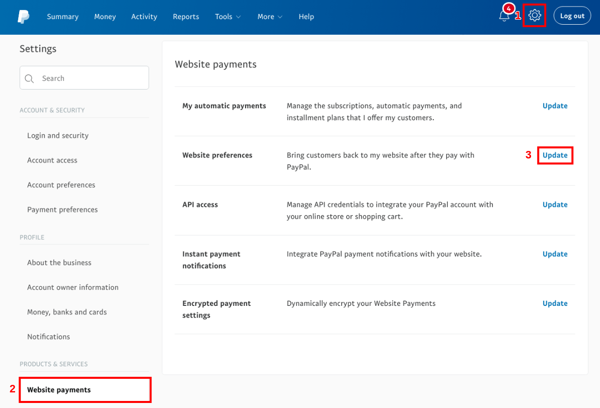

Auto Return
-----------

*Auto Return* automatically redirects your customers to Odoo once the
payment is processed. Check *Auto Return* and enter your domain name
with the suffix ``/shop/confirmation`` as *Return URL*
(e.g. ``https://yourcompany.odoo.com/shop/confirmation``).

This URL is requested in Paypal but not used in practice as Odoo
transmits it at each transaction. Don’t worry if you manage several
sales channels or Odoo databases.

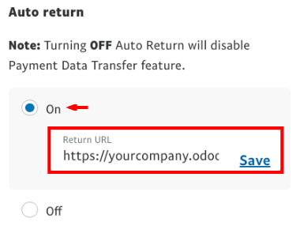

Payment Data Transfer (PDT)
---------------------------

*Payment Data Transfer* delivers the payment confirmation to Odoo as
soon as it is processed. Without it, Odoo cannot end the sales flow.
This setting must be activated as well. When saving, an *Identity
Token* is generated. You will be later requested to enter it in Odoo.

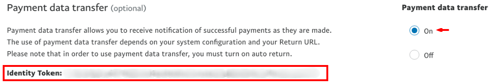

Paypal Account Optional

We advise you to not prompt customers to log in with a Paypal account
when they get to pay. Let them pay with debit/credit cards as well, or you might lose some deals. Make sure this setting is turned on.

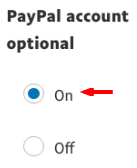

Instant Payment Notification (IPN)
----------------------------------

PDT sends order confirmations once and only once. As a result, your site
must be running when it happens; otherwise, it will never receive the
message. That’s why we advise to activate the *Instant Payment
Notification* (IPN) on top. With IPN, delivery of order confirmations
is virtually guaranteed since IPN resends a confirmation until your site acknowledges receipt.

| To activate IPN, get back to *Website payments* menu and click
  *Update* in *Instant Payment Notification*.
| The *Notification URL* to set is your domain name +
  “payment/paypal/ipn” (e.g. ``https://yourcompany.odoo.com/payment/paypal/ipn``).

.. image:: media/paypal05.png
    :align: center

Payment Messages Format
-----------------------

If you use accented characters (or anything else than basic Latin characters)
for your customer names, addresses... you MUST configure the encoding format of
the payment request sent by Odoo to Paypal.

.. danger::

    If you don't configure this setting, some transactions fail without notice.

To do so, open:

* `this page for a test account <https://sandbox.paypal.com/cgi-bin/customerprofileweb?cmd=_profile-language-encoding>`__

* `this page for a production account <https://www.paypal.com/cgi-bin/customerprofileweb?cmd=_profile-language-encoding>`__

Then, click *More Options* and set the two default encoding formats as **UTF-8**.

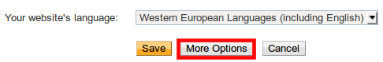

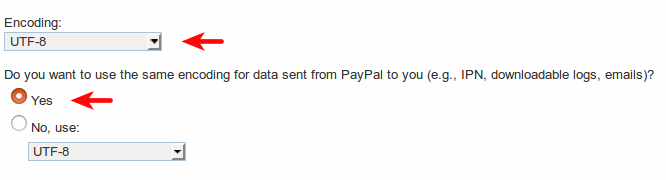

Your Paypal account is ready!

.. tip::
   If you want your customers to pay without creating a Paypal account,
   *Paypal Account Optional* needs to be turned on.
    
   .. image:: media/paypal_account_optional.png

.. tip::
   For Encrypted Website Payments & EWP_SETTINGS error,
   please check the `Paypal documentation <https://developer.paypal.com/docs/
   classic/paypal-payments-standard/integration-guide/encryptedwebpayments/
   #encrypted-website-payments-ewp>`_.

Settings in Odoo
================

Activation
----------

Activate *Paypal* from the config bar of Sales, Invoicing and
eCommerce apps, or from the configuration menu of *Payment Acquirers*.

Credentials
-----------

Odoo requires three Paypal credentials:

- *Email ID* is your login email address in Paypal.
- *Merchant ID* can be found in the settings of your Paypal account, in
  :menuselection:`Account Settings --> Business information`.
- *Paypal PDT Token* is given in *Website payments* configuration as explained here above.

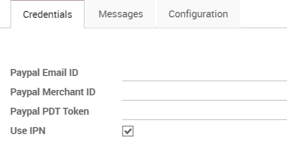

Transaction fees
----------------

You can charge extra fees to your customers for paying with Paypal;
This to cover the transaction fees Paypal charges you. Once redirected to Paypal, your customer sees an extra applied to the order amount.

To activate this, go to the Configuration tab of Paypal configuration in
Odoo and check *Add Extra Fees*.

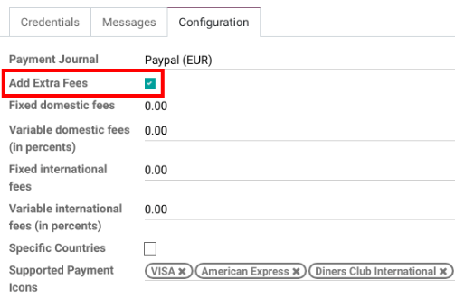

You can refer to `Paypal Fees <https://www.paypal.com/webapps/mpp/paypal-fees>`__ to set up
fees.

.. note::
   `Traders in the EU <https://europa.eu/youreurope/citizens/consumers/shopping/pricing-payments/
   index_en.htm>`_ are not allowed to charge extra fees for paying with credit cards.

Go live!
========

Your configuration is ready to roll. Make sure *Production* mode is
on. Then publish the payment method by clicking the *Published* button right next to it.

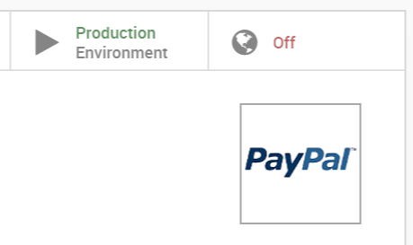

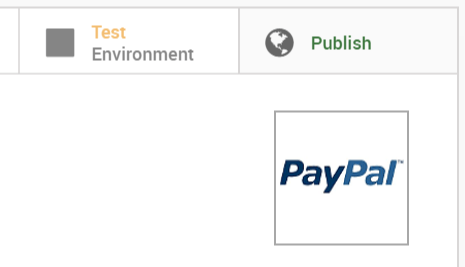

Paypal is now available in your payment form available in eCommerce,
Sales and Invoicing apps. Customers are redirected to Paypal website
when hitting *Pay Now*. They get back to a confirmation page in Odoo
once the payment is processed.

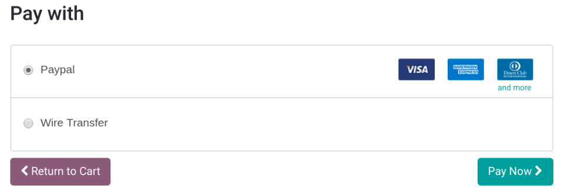

Test environment
================

You can test the entire payment flow in Odoo thanks to Paypal Sandbox accounts.

Log in to `Paypal Developer Site <https://developer.paypal.com/>`__ with your Paypal credentials.

This will create two sandbox accounts:

-  A business account (to use as merchant, e.g. `pp.merch01-facilitator@example.com <mailto:pp.merch01-facilitator@example.com>`__).

-  A default personal account (to use as shopper, e.g. `pp.merch01-buyer@example.com <mailto:pp.merch01-buyer@example.com>`__).

Log in to Paypal Sandbox with the merchant account and follow the same configuration instructions.
Enter your sandbox credentials in Odoo and make sure Paypal is still
set on *Test Environment*. Also, make sure the automatic invoicing
is not activated in your eCommerce settings, to not generate invoices
when a fictitious transaction is completed.

Run a test transaction from Odoo using the sandbox personal account.

.. seealso::
   - :doc:`payment_acquirers`
   - :doc:`../../ecommerce/shopper_experience/payment_acquirer`
