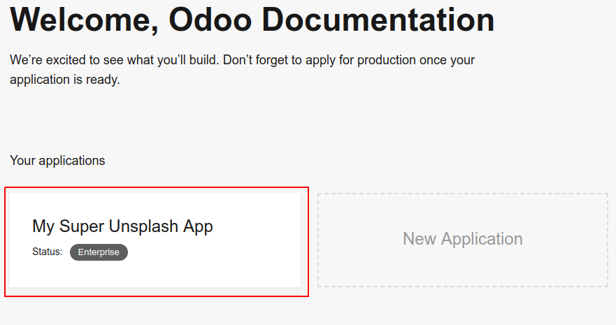
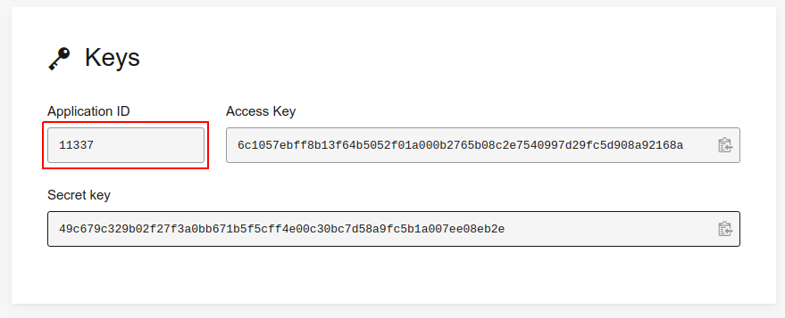

=======================================================
How to generate an Unsplash application ID
=======================================================

- You should first create and set up your Unsplash application with this tutorial: `How to generate an Unsplash access key <https://www.odoo.com/documentation/user/unsplash_access_key.html>`_.

- Go to your `applications dashboard <https://unsplash.com/oauth/applications>`_ and click on your newly created Unsplash application under **Your applications**.

- You will be redirected to your application details page. The **application ID** will be visible in your browser's URL. The URL should be something like ``https://unsplash.com/oauth/applications/application_id``

.. image:: media/app_id_url.png
    :align: center

- Note that if you `apply for a production account <https://unsplash.com/documentation#registering-your-application>`_ and it got approved, your will also find your application ID in the UI. It will be listed next to your **Access Key** on your application details page.

