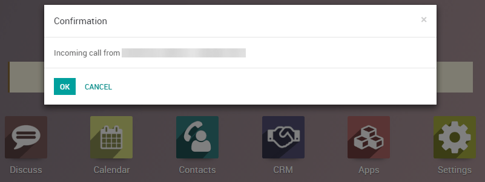

=====================================
Use VoIP services in Odoo with Axivox
=====================================

Introduction
============

Odoo VoIP can be set up to work together with `Axivox <https://www.axivox.com/>`_. In that case, an
:doc:`Asterisk server <asterisk>`'s installation and setup are not necessary as the whole
infrastructure is hosted and managed by Axivox.

You need to open an account with Axivox to use this service by
`contacting Axivox <https://www.axivox.com/contact/>`_. Before doing so, make sure that the service
covers your area and the areas you wish to call.

Configuration
=============

Go to :menuselection:`Apps` and install the **VoIP Module**.

.. image:: media/axivox-voip-installation.png
   :align: center

Go to :menuselection:`Settings --> General Settings --> Integrations`, and fill out the **Asterisk
(VoIP)** field:

- **PBX Server IP**: set the domain created by Axivox for your account (e.g.,
  *yourcompany.axivox.com*)
- **WebSocket**: type in `wss://pabx.axivox.com:3443`
- **VoIP Environment**: set as *Production*

.. image:: media/axivox-voip-configuration.png
   :align: center

Go to :menuselection:`Settings --> Users & Companies --> Users`, then open the user you want to
configure. Under the **Preferences** tab, fill out the section **PBX Configuration**:

- **SIP Login / Browser's Extension**: Axivox *username*
- **SIP Password**: the Axivox *SIP Password*

.. note::
   You can find all this information by logging in at https://manage.axivox.com/, select the user
   you want to configure and refer to the fields as pictured below.

   .. image:: media/axivox-manager-sip.png
      :align: center

Phone Calls
===========

You can make phone calls by clicking the phone icon in the top right corner of Odoo (make sure you
are logged in as a user properly configured in Odoo and in Axivox).

You can also receive phone calls. Odoo rings and displays a notification. Your number is the one
provided by Axivox.

.. note::
   If you see a *Missing Parameter* message in the **Odoo softphone**, make sure to refresh your
   Odoo window and try again.

   .. image:: media/axivox-missing-parameter.png
      :align: center

.. note::
   If you see an *Incorrect Number* message in the Odoo softphone, make sure to use the
   international format, leading with the plus (+) sign followed by the international country code.
   E.g., +16506913277 (where +1 is the international prefix for the United States).

   .. image:: media/axivox-incorrect-number.png
      :align: center