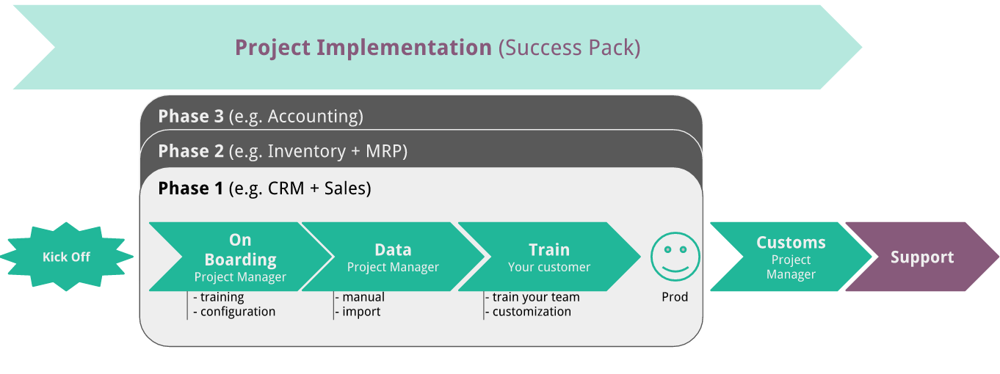
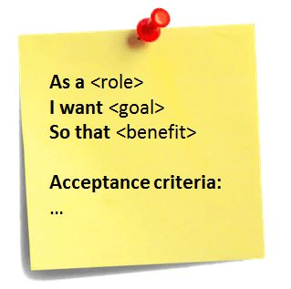

:banner: banners/getting_started.png

====================================
Basics of the QuickStart Methodology
====================================

This document summarizes Odoo Online's services, our Success Pack
implementation methodology, and best practices to get started with our
product.

1. The SPoC (*Single Point of Contact*) and the Consultant
==========================================================

Within the context of your project, it is highly recommended to
designate and maintain on both sides (your side and ours) **one
and only single person of contact** who will take charge and assume
responsibilities regarding the project. He also has to have **the
authority** in terms of decision making.

-  **The Odoo Consultant ensures the project implementation from A to Z**:
   From the beginning to the end of the project, he ensures the overall
   consistency of the implementation in Odoo and shares his expertise
   in terms of good practices.

-  **One and only decision maker on the client side (SPoC)**:
   He is responsible for the business knowledge transmission
   (coordinate key users intervention if necessary) and the consistency
   of the implementation from a business point of view (decision
   making, change management, etc.)

-  **Meetings optimization**:
   The Odoo consultant is not involved in the process of decision
   making from a business point of view nor to precise processes and
   company's internal procedures (unless a specific request or an
   exception). Project meetings, who will take place once or twice a
   week, are meant to align on the business needs (SPoC) and to define
   the way those needs will be implemented in Odoo (Consultant).

-  **Train the Trainer approach**:
   The Odoo consultant provides functional training to the SPoC so that
   he can pass on this knowledge to his collaborators. In order for
   this approach to be successful, it is necessary that the SPoC is
   also involved in its own rise in skills through self-learning via
   the `Odoo documentation <http://www.odoo.com/documentation/user/10.0/index.html>`__, `The elearning platform <https://odoo.thinkific.com/courses/odoo-functional>`__ and the testing of functionalities.

2. Project Scope
================

To make sure all the stakeholders involved are always aligned, it is
necessary to define and to make the project scope evolve as long as the
project implementation is pursuing.

-  **A clear definition of the initial project scope**:    
   A clear definition of the initial needs is crucial to ensure the
   project is running smoothly. Indeed, when all the stakeholders share
   the same vision, the evolution of the needs and the resulting
   decision-making process are more simple and more clear.

-  **Phasing the project**:
   Favoring an implementation in several coherent phases allowing
   regular production releases and an evolving takeover of Odoo by the
   end users have demonstrated its effectiveness over time. This
   approach also helps to identify gaps and apply corrective actions
   early in the implementation.

-  **Adopting standard features as a priority**:
   Odoo offers a great environment to implement slight improvements
   (customizations) or more important ones (developments).
   Nevertheless, adoption of the standard solution will be preferred as
   often as possible in order to optimize project delivery times and
   provide the user with a long-term stability and fluid scalability of
   his new tool. Ideally, if an improvement of the software should
   still be realized, its implementation will be carried out after an
   experiment of the standard in production.

3. Managing expectations
========================

The gap between the reality of an implementation and the expectations of
future users is a crucial factor. Three important aspects must be taken
into account from the beginning of the project:

-  **Align with the project approach**:
   Both a clear division of roles and responsibilities and a clear
   description of the operating modes (validation, problem-solving,
   etc.) are crucial to the success of an Odoo implementation. It is
   therefore strongly advised to take the necessary time at the
   beginning of the project to align with these topics and regularly
   check that this is still the case.

-  **Focus on the project success, not on the ideal solution**:
   The main goal of the SPoC and the Consultant is to carry out the
   project entrusted to them in order to provide the most effective
   solution to meet the needs expressed. This goal can sometimes
   conflict with the end user's vision of an ideal solution. In that
   case, the SPoC and the consultant will apply the 80-20 rule: focus
   on 80% of the expressed needs and take out the remaining 20% of the
   most disadvantageous objectives in terms of cost/benefit ratio
   (those proportions can of course change over time). Therefore, it
   will be considered acceptable to integrate a more time-consuming
   manipulation if a global relief is noted.
   Changes in business processes may also be proposed to pursue this
   same objective.

-  **Specifications are always EXPLICIT**:
   Gaps between what is expected and what is delivered are often a
   source of conflict in a project. In order to avoid being in this
   delicate situation, we recommend using several types of tools\* :

-  **The GAP Analysis**: The comparison of the request with the standard
   features proposed by Odoo will make it possible to identify the
   gap to be filled by developments/customizations or changes in
   business processes.

-  **The User Story**:
   This technique clearly separates the responsibilities between the
   SPoC, responsible for explaining the WHAT, the WHY and the WHO,
   and the Consultant who will provide a response to the HOW.

- `The Proof of Concept <https://en.wikipedia.org/wiki/Proof_of_concept>`__ 
  A simplified version, a prototype of what is expected to agree on
  the main lines of expected changes.

- **The Mockup**: In the same idea as the Proof of Concept, it will align
  with the changes related to the interface.

To these tools will be added complete transparency on the possibilities
and limitations of the software and/or its environment so that all
project stakeholders have a clear idea of what can be expected/achieved
in the project. We will, therefore, avoid basing our work on hypotheses
without verifying its veracity beforehand.

*This list can, of course, be completed by other tools that would more
adequately meet the realities and needs of your project*

4. Communication Strategy
=========================

The purpose of the QuickStart methodology is to ensure quick ownership
of the tool for end users. Effective communication is therefore crucial
to the success of this approach. Its optimization will, therefore, lead
us to follow those principles:

-  **Sharing the project management documentation**:
   The best way to ensure that all stakeholders in a project have the
   same level of knowledge is to provide direct access to the project's
   tracking document (Project Organizer). This document will contain
   at least a list of tasks to be performed as part of the
   implementation for which the priority level and the manager are
   clearly defined.

   The Project Organizer is a shared project tracking tool that
   allows both detailed tracking of ongoing tasks and the overall
   progress of the project.

-  **Report essential information**:
   In order to minimize the documentation time to the essentials, we
   will follow the following good practices:

-  Meeting minutes will be limited to decisions and validations;

-  Project statuses will only be established when an important milestone
   is reached;

-  Training sessions on the standard or customized solution will be
   organized.

5. Customizations and Development
=================================

Odoo is a software known for its flexibility and its important evolution
capacity. However, a significant amount of development contradicts a
fast and sustainable implementation. This is the reason why it is
recommended to:

-  **Develop only for a good reason**:
   The decision to develop must always be taken when the cost-benefit
   ratio is positive (saving time on a daily basis, etc.). For example,
   it will be preferable to realize a significant development in order
   to reduce the time of a daily operation, rather than an operation to
   be performed only once a quarter. It is generally accepted that the
   closer the solution is to the standard, the lighter and more fluid
   the migration process, and the lower the maintenance costs for both
   parties. In addition, experience has shown us that 60% of initial
   development requests are dropped after a few weeks of using standard
   Odoo (see "Adopting the standard as a priority").

-  **Replace, without replicate**:
   There is a good reason for the decision to change the management
   software has been made. In this context, the moment of
   implementation is THE right moment to accept and even be a change
   initiator both in terms of how the software will be used and at the
   level of the business processes of the company.

6. Testing and Validation principles
====================================

Whether developments are made or not in the implementation, it is
crucial to test and validate the correspondence of the solution with the
operational needs of the company.

-  **Role distribution**:
   In this context, the Consultant will be responsible for delivering a
   solution corresponding to the defined specifications; the SPoC will
   have to test and validate that the solution delivered meets the
   requirements of the operational reality.

-  **Change management**:
   When a change needs to be made to the solution, the noted gap is
   caused by:
   
   -  A difference between the specification and the delivered solution - This is a correction for which the Consultant is responsible
   
      **or**
   
   -  A difference between the specification and the imperatives of
      operational reality - This is a change that is the responsibility of SPoC.

7. Data Imports
===============

Importing the history of transactional data is an important issue and
must be answered appropriately to allow the project running smoothly.
Indeed, this task can be time-consuming and, if its priority is not well
defined, prevent production from happening in time. To do this as soon
as possible, it will be decided :

-  **Not to import anything**:
   It often happens that after reflection, importing data history is
   not considered necessary, these data being, moreover, kept outside
   Odoo and consolidated for later reporting.

-  **To import a limited amount of data before going into production**:
   When the data history relates to information being processed
   (purchase orders, invoices, open projects, for example), the need to
   have this information available from the first day of use in
   production is real. In this case, the import will be made before the
   production launch.

-  **To import after production launch**:
   When the data history needs to be integrated with Odoo mainly for
   reporting purposes, it is clear that these can be integrated into
   the software retrospectively. In this case, the production launch of
   the solution will precede the required imports.

8. Support
==========

When your project is put in production, our support teams take care of your
questions or technical issues.

See :ref:`support-expectations`.
