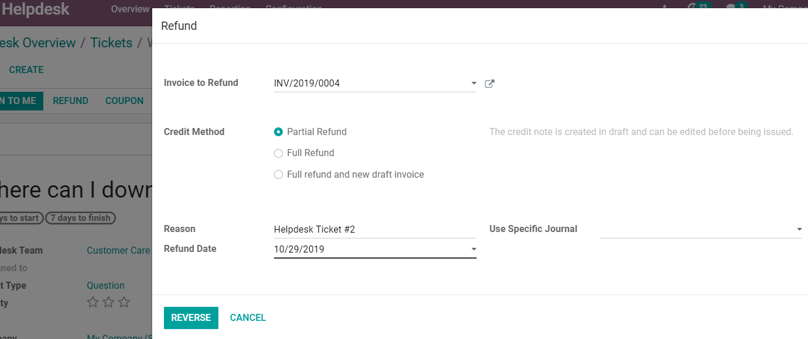

==========================================================================
After sales features: refund, coupon, return, repair, onsite interventions
==========================================================================

As my business grows, having the tools to allow my helpdesk team to record, track and manage issues
raised easy and efficiently, is key. Odoo’s Helpdesk app allows me to generate credit notes, return
products, grant coupons, do repairs and plan onsite interventions from a ticket’s page.

Set up the After Sales services
===============================

Go to :menuselection:`Configuration --> Helpdesk Teams` and enable the After Sales options:
*Refunds, Returns, Coupons, Repairs and Onsite Interventions*.

Generate credit notes from tickets
=========================================

I can use a credit note to refund a customer or adjust the amount due. For that, I’ll simply go to
my ticket page, click on *Refund* and select the corresponding *Invoice*. Clicking on *Reverse* the
credit note will be generated, and I can *Post* it while still being in the *Helpdesk* app.

Allow product returns from tickets
==================================

The process of a product return from my customer back to my warehouse will be taken into action
when, at the ticket page, I choose the option *Return*.

Grant coupons from tickets
==========================

First, be sure to have your *Coupon Program* planned at the *Sales or Website* app. At the
*Helpdesk* app, I will open my ticket and click on *Coupon*, choose the
:menuselection:`Coupon Program --> Generate`.

Repairs from tickets
====================

Clicking on *Repair* option, on my ticket page, a new repair order form will be shown. Fill up the
rest of the fields as needed and choose the next step.

Plan onsite interventions from tickets
======================================

At the ticket page, I can now configure my onsite interventions exactly the same way I would do
being on the *Field Service* app, clicking on *Plan Intervention*.

.. seealso::
   - `Coupons <https://www.odoo.com/slides/slide/coupon-programs-640?fullscreen=1>`_
   - :doc:`../../manufacturing/repair/repair`