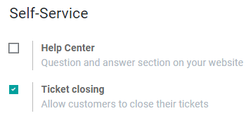
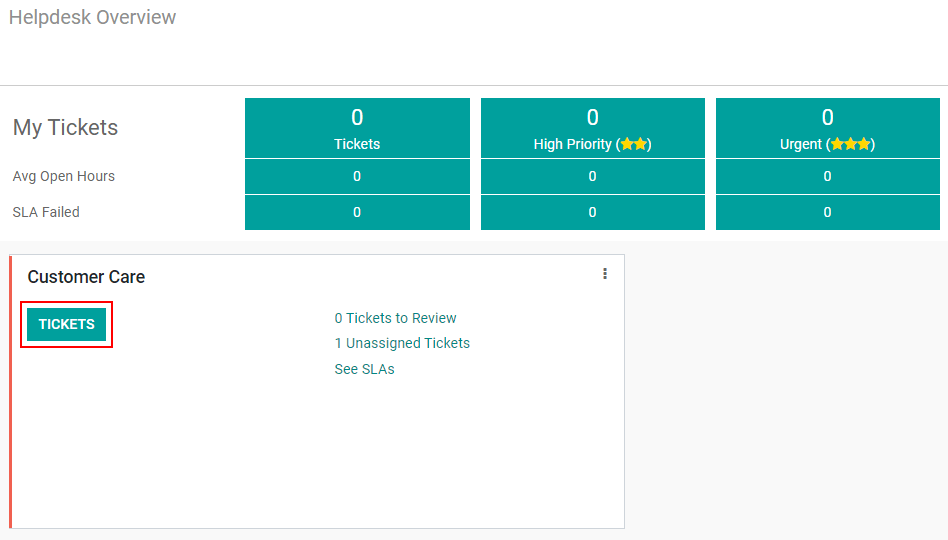
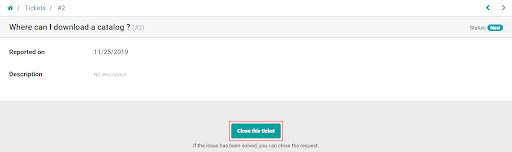
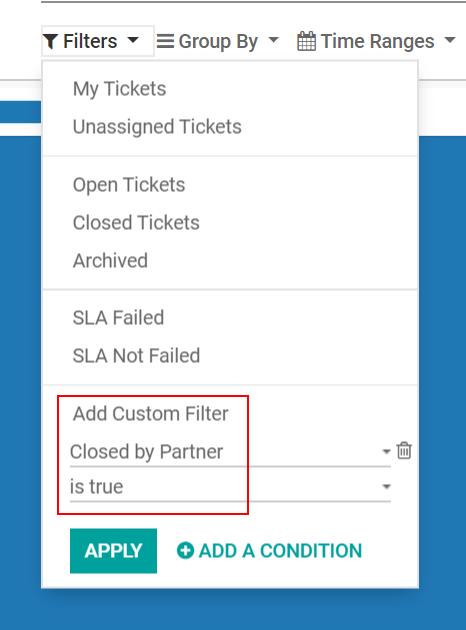

=======================================
Allow customers to close their tickets
=======================================

Allowing customers to close their tickets gives them autonomy and minimize misunderstandings about
when an issue is considered solved, or not. It makes communication and actions more efficient.

Configure the feature
======================

To configure the feature go to :menuselection:`Helpdesk --> Settings --> Helpdesk Teams --> Edit`
and enable *Ticket closing*.

In order to designate to which stage the ticket will migrate to once it is closed, go to
:menuselection:`Overview --> Tickets`.

You can either create a new kanban stage or work with an existing one. For both scenarios, go to
:menuselection:`Settings --> Edit Stage` and enable *Closing Stage*.

.. image:: media/closetickets3.png
   :align: center
   :alt: Ticket closing in Odoo Helpdesk

If a closing stage is not specified, by default, the ticket will be transferred to the last stage; contrarily, if you have more than one stage set as closing, the ticket will be put in the first one.

The Costumer Portal 
====================

Now, once the user logs in to his Portal, the option *Close this ticket* is available.

Get reports on tickets closed by costumers
===========================================

To do an analysis of the tickets that have been closed by costumers go to
:menuselection:`Reporting --> Tickets --> Filters --> Add Custom filter --> Closed by partner -->
Applied`.

