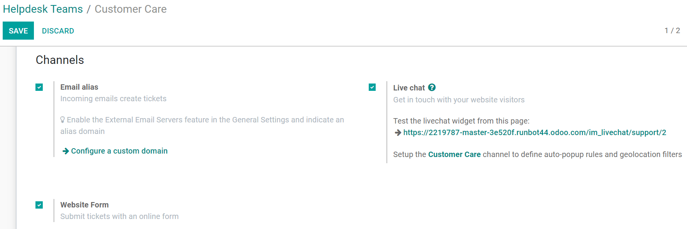
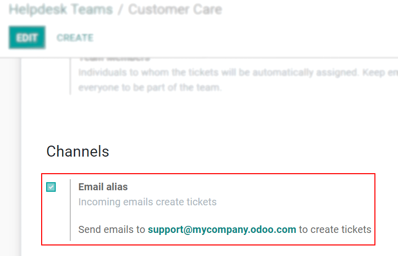
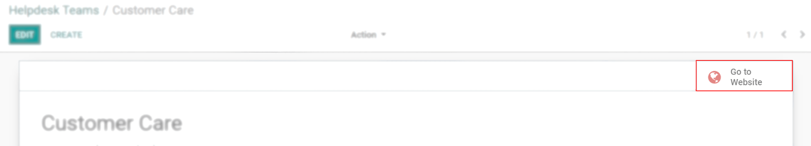
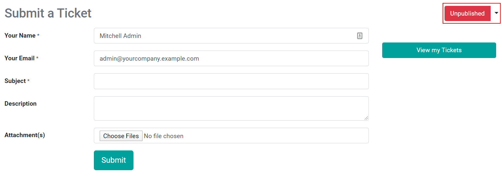
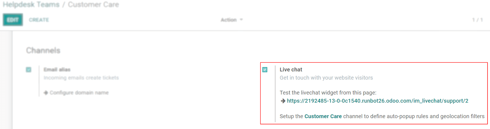
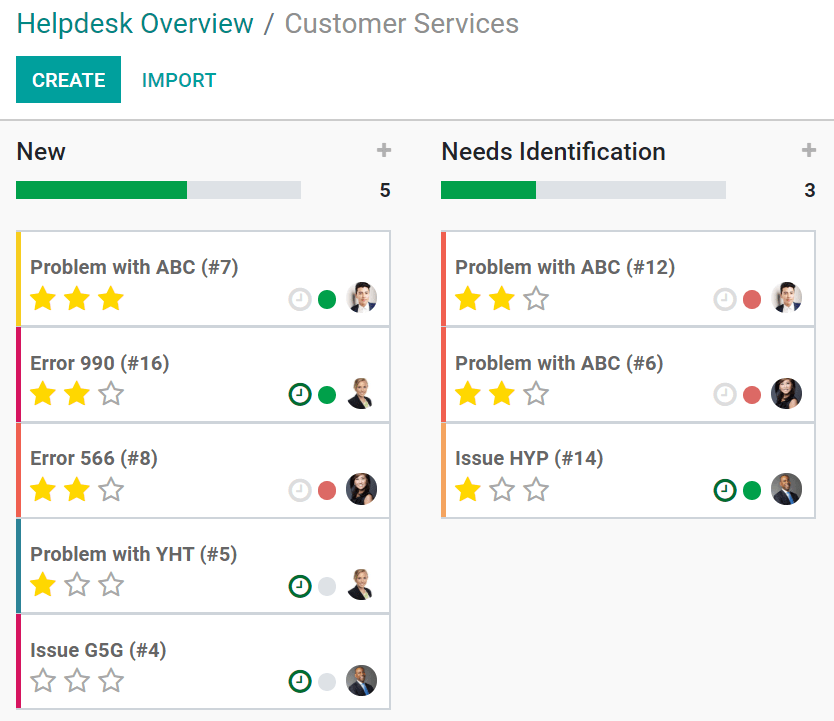

=======================
Start Receiving Tickets
=======================

Offering a variety of channels from where your customers can contact you grants them flexibility
and the right to choose the best one for themselves. And, in order to make sure inquiries across
all channels get addressed, it is essential to have a solution where all interactions come in one
place.

Channels options to submit tickets
==================================

Go to :menuselection:`Helpdesk --> Configuration --> Helpdesk Teams`, and enable the following
features as you want them to be available to your users.

Email Alias
-----------

| Let your customers submit tickets by sending an email to your support email address. The subject
  line of the email becomes the title of the ticket and the content is shown in the Chatter.
| Select *Configure domain name* to be redirected to *Settings* and, from there, enable *External
  Email Servers* to determine or change your *Alias Domain*.

         in Odoo Helpdesk

.. note::
   Using your own email server is required to send and receive emails in Odoo Community and
   Enterprise. Online users benefit from a ready-to-use email server.

Website Form
------------

| Allow your customers to submit a ticket by filling in a form through your website.
| Once the feature is activated, get redirected to your website by clicking on *Go to Website*.

         Odoo Helpdesk

From the website page customize the form as you like. Then, publish it by clicking on *Unpublished*.

Live Chat
---------

| Through live interactions with your website visitors, helpdesk tickets can be instantly created
  and redirected to the right person.
| Click on your helpdesk team's name - for the example below: *Customer Care* -
  and :doc:`set up your channel <../../livechat/overview/get_started>`.

         in Odoo Helpdesk

Now, your operators can create tickets by using the
:doc:`command <../../livechat/overview/responses>` */helpdesk (subject_of_ticket)*.

Prioritize tickets
==================

Use the stars to prioritize your tickets. The most urgent ones appear at the top of your list on
the Kanban view.

- 1 star = *Low priority*
- 2 stars = *High priority*
- 3 stars = *Urgent*

.. seealso::
   - :doc:`sla`
   - :doc:`../advanced/close_tickets`
   - :doc:`../../email_communication/advanced/email_servers`
