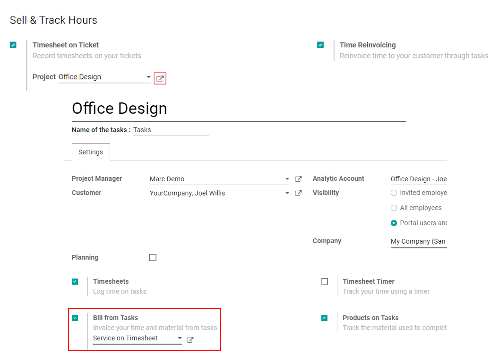
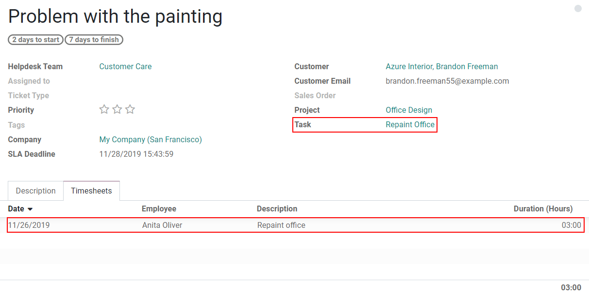
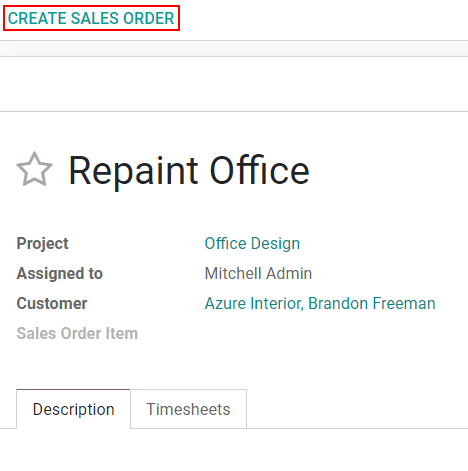

==============================================================
Turn helpdesk hours into invoices directly from a project task
==============================================================

Directly pull the billable time you have tracked on your helpdesk tickets into sales orders and
invoices through a project task. It gives you more control over what you charge your client, and it
is more efficient.

Configuration
==============

Go to :menuselection:`Helpdesk --> Configuration --> Helpdesk team --> Edit` and enable the options
*Timesheet on Ticket* and *Time Reinvoicing*.
Under *Timesheet on Ticket*, choose the *Project* to which the tickets (and timesheets) will be
linked by default. Open its *External link* to enable the feature *Bill from tasks*.

Create a sales order and an invoice
====================================

Now, once you added the time you spent on the helpdesk ticket, under the *Timesheets* tab, access
the task clicking on its name.

*Create Sales Order* and proceed to create the invoice.

