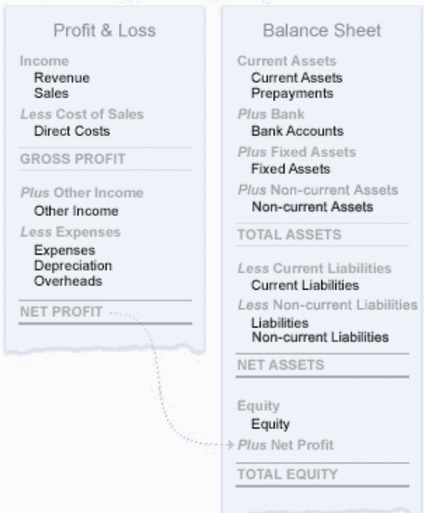

:classes: stripe

==========================================
Understanding Accounting For Entrepreneurs
==========================================

Financial accounting is used to know the situation of a company (its balance
sheet) and its performance (Profit and Loss, P&L). It is set up by reporting
every financial transaction in the relevant accounts of a Chart of Accounts.

.. rst-class:: intro-list

* .. rst-class:: intro-p-l

  **P&L** is always analysed on a specific period rather than since the
  company's founding (e.g. 2014, Q3 2012, …).

* .. rst-class:: intro-gross-profit

  **Gross profits** is revenues (sales, interest, royalties) minus cost of
  goods sold (raw materials, storage costs, production labor costs).

* .. rst-class:: intro-opex

  **Operating expenses** include administration, sales and R&D salaries as
  well as rent and utilities, legal costs, insurance, ... anything beyond
  fabrication itself.

* .. rst-class:: intro-balance

  The **Balance sheet** is a snapshot of the situation at a specific moment,
  listing the company's assets and its liabilities at that point.

* .. rst-class:: intro-assets

  **Assets** represent the company's wealth. A person's assets would be a
  house or car ("fixed" or "tangible" assets), bank accounts or cash ("liquid"
  or "current" assets). For a company, a client owing money is an asset. An
  employee is not an asset as it is not owned by the company (slavery being
  illegal under the International Covenant on Civil and Political Rights's
  article 8).

* .. rst-class:: intro-liabilities

  **Liabilities** are obligations from past events resulting in future use or
  transfer of current assets (utility bills, debts, payroll, unpaid
  suppliers).

* .. rst-class:: intro-equity

  **Equity** is assets which have no liability counterpart: shares, other
  stocks and surplus.

Assets have necessarily been financed via liabilities or equity: a company can
buy work space through profits, borrowing money or injected capital (for
shares).

A difference is made between assets (e.g. a building) and expenses (e.g. fuel)
in assets having intrinsic value over time, versus expenses having value in
them being consumed for the company to "work".

.. rst-class:: force-right accounts-table

   Assets = Liabilities + Equity

   What is owned has been financed through debts to reimburse or acquired
   assets (profits, capical).

Chart of Accounts
=================

The **chart of accounts** lists all the accounts used by the company, whether
they are balance sheet accounts (assets and liabilities) or P&L accounts
(revenues and expenses), and provides their state at a given moment, generally
the current point of an ongoing financial period, or the state at the end of a
closed financial period.

The accounts are used to organize and classify the finances of the company in
order to better understand its state and health, and the chart of accounts can
be used to get a snapshot of a company's financial period: because it includes
P&L, a chart of accounts is also generally viewed over a specific period.

.. rst-class:: force-right

Balance = debit - credit
------------------------

.. h:div:: chart-of-accounts

   Requires javascript

Journal Entries
===============

The chart of accounts displays the state of the company at a given moment
("current" or over an accounting period).

This state is the effect of the company's financial operations (being paid for
services, paying rent, receiving interests, …). These transactions are
recorded as journal entries over the course of financial periods:

Each *journal entry* is the interaction between at least two accounts (one
being debited and the other one credited). For a journal entry to be
*balanced*, the sum of all its debits must be equal to the sum of all its
credits. A journal entry almost always corresponds to a separate justifying
document (invoice, pay slip, …; financial audits may include matching entries
to the "hard" evidence of these documents).

A journal entry is composed of multiple *journal items*. Journal items are
either a credit or a debit on a specific account, and journal entries are thus
composed of at least two items.

Companies can triage entries in various journals based on their nature or
context. Common journals are:

* a sales journal with all client transactions
* a purchase journal with all supplier transactions
* a bank journal for bank statements
* a cash journal for cash operations

.. h:div:: force-right journal-entries

   examples of accounting entries for various transactions

Reconciliation
==============

At a financial level, journal entries (and the corresponding operations in a
company's account) are independent from one another: the invoices a company
emits and the payments it receives are separate journal entries and the
account operations are not correlated.

It's thus easy to know how much was sold (by tallying the income account) and
how the company is still owed overall (receivables) but not how much a
specific client owes or which specific invoices are still unpaid (in order to
send reminders for instance).

Reconciliation is the process of correlating and linking journal items,
matching the credits and debits of a specific account.

* within a single account, look for all non-reconciled items
* link debiting items with crediting items, each side (debiting and crediting)
  can have mutliple items.

For instance a customer could be sent two invoices for 121€ and 63€ (debits to
the Receivable account), and send three payments of 75€, 75€ and 34€.

The system can then use reconciliation to automatically mark invoices as paid
(or partially paid), prepare and send reminders, flag accounting issues, …

.. h:div:: force-right

   .. todo:: show reconciliation process, use Odoo interface?

Bank Reconciliation
-------------------

Bank reconciliation is the process of finding and explaining the differences
between the bank statements provided by banks and the company's own
accounting. It is used to both import the bank's operations into the internal
books (e.g. banking or overdraft fees) and discover issues (missing records,
checks not passed to banks, operation inversions, …).

There are two main ways to perform bank reconciliation:

Intermediate account
~~~~~~~~~~~~~~~~~~~~

Bank statements can be encoded in a dedicated "bank" account, which is then
reconciled normally.

.. h:div:: force-right

   * encode a check being sent:

     +--------------------+-----+------+
     |                    |Debit|Credit|
     +--------------------+-----+------+
     |Accounts Payable    |121  |      |
     +--------------------+-----+------+
     |Emitted Checks      |     |121   |
     +--------------------+-----+------+

   * get the bank statement and encode it:

     +-----------------+-----+------+
     |                 |Debit|Credit|
     +-----------------+-----+------+
     |Emitted Checks   |121  |      |
     +-----------------+-----+------+
     |Bank             |     | 121  |
     +-----------------+-----+------+

   * reconcile on the Emitted Checks account, it is a normal reconciliation
     process between two journal items

Bank reconciliation
~~~~~~~~~~~~~~~~~~~

The operation can also be implemented specifically, this is used e.g. in the
US. In that situation, each act having to do with a potential bank account
operation (bank transfer, check, payment notification) is immediately encoded
to a journal entry and when the bank statement is received its entries are
correlated to the previously encoded entries.

In that case, the bank statement does not generate entries, it only points
to/validates previously created entries.

.. note:: In Odoo, that would be Pay Invoice -> Import Bank Statement, only
          added to master mid-january.
