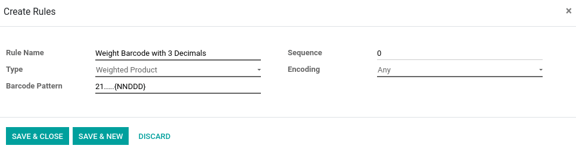
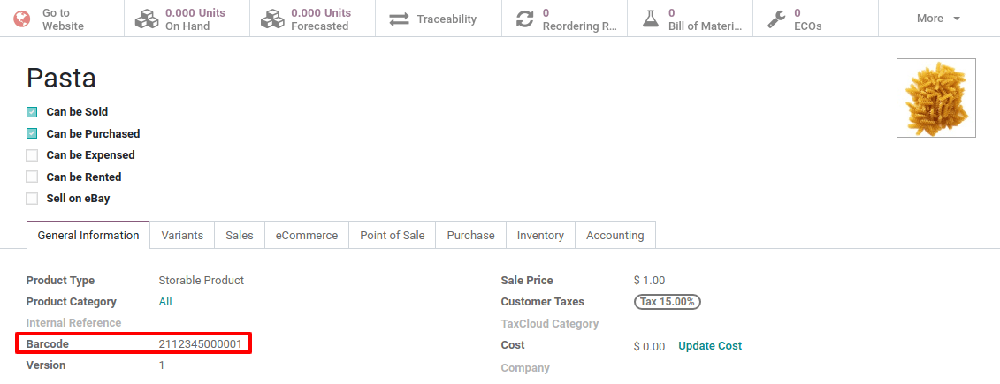

==============================
Work with Barcode Nomenclature
==============================

There are different situations in which barcode nomenclatures can be
useful. A well-known use case is the one of a point of sales that sells
products in bulk. The customers will scale their products themselves and
get the printed barcode to stick on the product. This barcode will
contain the weight of the product and help compute the price
accordingly.

Create a Barcode Nomenclature
=============================

Odoo supports *Barcode Nomenclatures*, which determine the mapping and
interpretation of the encoded information.

To configure the *Barcode Nomenclature*, you need to activate the
debug mode. To do so, go to *Inventory > Configuration > Barcode
Nomenclature*.

You can create a barcode nomenclature from there, and then add a line to
create your first rule.

.. image:: media/barcode_nomenclature_01.png
    :align: center

The first step is to specify the *rule name*, for example, *Weight
Barcode* with 3 decimals. Then, you have to specify the type for
barcode nomenclature, like the *Weighted Product*.

The *Barcode Pattern* is a regular expression that defines the
structure of the barcode. In this example, 21 defines the products on
which the rule will be applied. Those are the numbers by which the
product barcode should start. The 5 “dots” are the following numbers of
the product barcode and are there to identify the product in question.
The “N” defines a number and the “D” defines the decimals.

.. note::
        You can define different rules and order their priority thanks to the
        sequence. The first rule that matches the scanned barcode will then be
        applied.

Configure your Product
======================

1. The barcode of the product should start by “21”;

2. The 5 “dots” are the other numbers of your product barcode, allowing to identify the product;

3. The barcode should contain 0’s when you did defined D’s or N’s. In our case, we need to set 5 zeros because we condigures “21………{NNDDD}”;

4. In EAN-13, the last number is a check number. Use an EAN13 generator to know which digit it should be in your case.

In case you weight 1,5kg of pasta, the balance will print you the
following barcode: *2112345015001*. If you scan this barcode in your
PoS, or when receiving the products in your barcode app, Odoo will
automatically create a new line for the product, for a quantity of
1,5kg.

For the point of sale, a price depending on the quantity will also be
computed.

.. image:: media/barcode_nomenclature_04.png
    :align: center

Rule Types
==========

-  **Priced Product**: it allows you to identify the product and specify its price, used in PoS;

-  **Discounted Product**: it allows you to create one barcode per applied discount. Then, you can scan your product in the PoS and apply discounts on the product by scanning the discount barcode;

-  **Weighted Product**: it allows you to identify the product and specify its weight, used in both PoS and in Inventory;

-  **Client**: it allows you to identify the customer, for example used with loyalty program;

-  **Cashier**: it allows you to identify the cashier when entering the PoS;

-  **Location**: it allows you to identify the location on a transfer when multi-location is activated;

-  **Package**: it allows you to identify packages on a transfer when packages are activated;

-  **Lot**: it allows you to identify the lot number of a product on a transfer;

-  **Credit Card**: it doesn’t need manual modification, exists for data from the Mercury module;

-  **Unit Product**: it allows you to identify a product for both PoS and Transfers.

.. note::
        When the barcode pattern contains .*, it means that it can contain any
        number of characters. Those characters can be any number.
