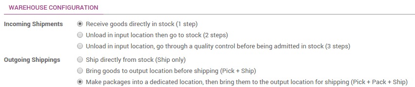
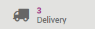
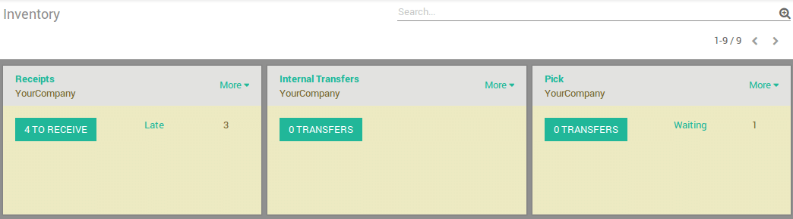
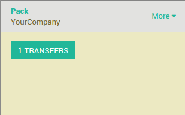

===================================================================
How to process delivery orders in three steps (pick + pack + ship)?
===================================================================

Overview
========

When an order goes to the shipping department for final delivery, Odoo
is set up by default on a **one-step** operation: once all goods are
available, they can be shipped in bulk in a single delivery order.
However, that process may not reflect the reality and your company may
require more steps before shipping.

With the **three steps** process (**Pick + Pack + Ship**), the items are
transferred to a packing area, where they will be assembled by area of
destination, and then set to outbound trucks for final delivery to the
customers.

A few configuration steps are necessary in order to accomplish **Pick +
Pack + Ship** in Odoo. These steps create some additional locations, which
by default are called **Output** and **Packing Zone**. So, if your warehouse's
code is ``WH``, this configuration will create a location called ``WH/Output``
and another one called ``WH/Packing Zone``.

Goods will move from **WH/Stock** to **WH/Packing Zone** in the first step.
Then move from **WH/Packing Zone** to **WH/Output**. Then finally it will be
delivered from **WH/Output** to its **final destination**.

.. note::
    Check out :doc:`inventory_flow` to determine if this inventory flow is 
    the correct method for your needs.

Configuration
=============

Install the Inventory module
----------------------------

From the **App** menu, search and install the **Inventory** module.

.. image:: media/three_steps07.png
   :align: center

You will also need to install the **Sales** module to be able to issue sales
orders.

Allow managing routes
---------------------

Odoo configures movement of delivery orders via **routes**. Routes
provide a mechanism to link different actions together. In this case, we
will link the picking step to the shipping step.

To allow management of routes, go to :menuselection:`Configuration --> Settings`

Under :menuselection:`Location & Warehouse --> Routes`, activate the radio button
**Advanced routing of products using rules**. Make sure that the option
**Manage several locations per warehouse** is activated as well.

.. image:: media/three_steps05.png
   :align: center

Configure the warehouse for Pick + Pack + Ship
-----------------------------------------------

Go to :menuselection:`Configuration --> Warehouses` and edit the warehouse that will be
used.

For outgoing shippings, set the option to **Make packages into a
dedicated location, bring them to the output location for shipping (Pick
+ Pack + Ship).**

Create a Sale Order
===================

From the **Sale** module, create a sales order with some products to deliver.

Notice that we now see ``3`` transfers associated with this sales order
in the **stat button** above the sales order.

If you click the button, you should now see three different pickings:

1.  The first with a reference **PICK** to designate the picking process,

2.  The second one with the reference **PACK** that is the packing process,

3.  The last with a reference **OUT** to designate the shipping process.

.. image:: media/three_steps04.png
   :align: center

Process a Delivery
==================

How to Process the Picking Step?
--------------------------------

Ensure that you have enough product in stock and Go to **Inventory** 
and click on the **Waiting** link under the **Pick** kanban card.

Click on the picking that you want to process.

Click on **Reserve** to reserve the products if they are available.

Click on **Validate** to complete the move from **WH/Stock** to **WH/Packing Zone**.

This has completed the picking Step and the **WH/PICK** should now show
**Done** in the status column at the top of the page. The product has
been moved from **WH/Stock** to **WH/Packing Zone** location, which makes the
product available for the next step (Packing).

How to Process the Packing Step?
--------------------------------

Go to **Inventory** and click on the **# TRANSFERS** link under the
**Pack** kanban card.

Click on the picking that you want to process.

Click on **Validate** to complete the move from **WH/Packing Zone** to
**WH/Output**.

This has completed the packing step and the **WH/PACK** should now show
**Done** in the status column at the top of the page. The product has
been moved from **WH/Packing Zone** to **WH/Output location**, which makes the
product available for the next step (Shipping).

How to Process the Shipping Step?
---------------------------------

Go to **Inventory** and click on the **# TO DO** link under the
**Delivery Orders** kanban card.

.. image:: media/three_steps02.png
   :align: center

Click on the picking that you want to process.

Click on **Validate** to complete the move from **WH/Output** to the
**customer** (Click **Apply** to assign the quantities based on the
quantities listed in the **To Do** column).

This has completed the shipping step and the **WH/OUT** should now show
**Done** in the status column at the top of the page. The product has
been shipped to the customer.

.. todo::
    Link to these sections when available
    -  Process Overview: From sales orders to delivery orders

    -  Process Overview: From purchase orders to receptions
