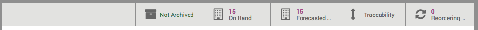
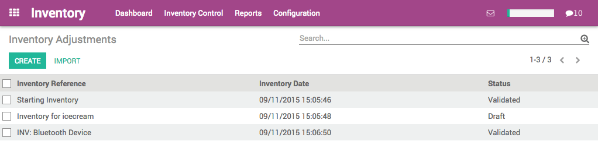
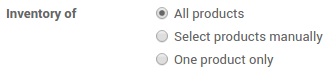

==================================
How to make the initial inventory?
==================================

One of the most important feature in an warehouse management software is
to keep the inventory right.

Once your products have been defined, it is time to make your initial
inventory. You will reflect reality by inventorying the right quantities
in the right locations.

Product Configuration
=====================

In the Inventory module, open the :menuselection:`Inventory Control --> Products`,
then click on **Create** to create a new product. Configure the
product type so that it is **Stockable** and not a consumable.

.. image:: media/initial01.png
   :align: center

Start the initial inventory
===========================

Update the product quantity for one product
-------------------------------------------

In the product you just created, you can see in the upper tiles that we
have 0 product On Hand. Click on the **Update qty on Hand** button.

A new window opens. In the **New Quantity on Hand** field, type the
quantity of product you currently hold in stock, then click on **Apply**.

.. image:: media/initial02.png
   :align: center

.. tip::

	if you are using multiple locations for your warehouse, you will
	be able to set the location of your product from this screen.

You can now see from the On Hand tab that the quantity has been updated.

Now, if you check the **Inventory Adjustments** in the **Inventory Control**
menu, you will see that a new line named "INV: (name of your product)" has
automatically been created and validated by the system.

Multiple products at once
-------------------------

Create all the products for which you want to follow the stock (as
stockable products). Once the required products in stock have been
defined, use an initial inventory operation to put the current
quantities into the system by location. Go to :menuselection:`Inventory Control -->
Inventory Adjustments` to start your initial inventory.

Give it a name (for example Initial Inventory) and select the stock
location of your inventory. Note that when you select a parent location
(such as Stock, which might be split into sub locations), you can also
select the sub (or child) locations.

.. image:: media/initial05.png
   :align: center

You can choose between making an inventory for all products, for a few
or only for one. In this case, we choose the **All products** option.

.. tip::

	If you need your stock valuation to be done in a different period
	than the one that will be selected by default according to the inventory
	end date, enter the corresponding accounting period in the Force
	Valuation Period field. The accounting module needs to be installed.

Click the **Start Inventory** button. Depending on the type of inventory you
have chosen (all products or selected ones) you might have to add
products manually by clicking on **Add an item**.

Add the **Real Quantity** that you have in your stock for each product.

.. tip::

	additional information will be available according to the options
	you activated (multi-locations, serial number, consignee stocks).

.. image:: media/initial07.png
   :align: center

Click the **Validate Inventory** button to confirm the inventory and post
it.

Reporting
=========

To check the current stock, go to :menuselection:`Inventory Control --> Products`,
and click on the **list button**:

.. image:: media/initial08.png
   :align: center
