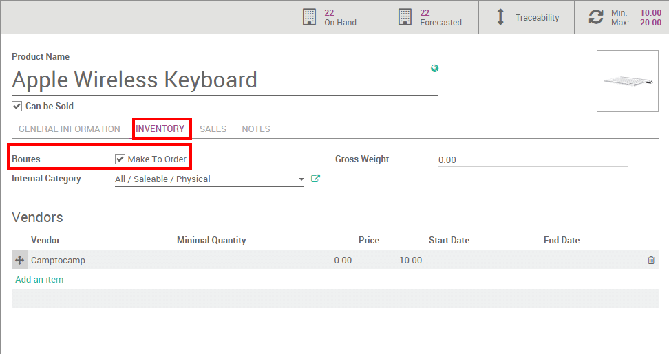

===========================================================
How to choose between minimum stock rule and make to order?
===========================================================

**Minimum Stock rules** and **Make to Order** have similar consequences but
different rules. They should be used depending on your manufacturing and
delivery strategies.

Terminology
===========

Minimum stock rule 
-------------------

**Minimum Stock** rules are used to ensure that you always have the minimum
amount of a product in stock in order to manufacture your products
and/or answer to your customer needs. When the stock level of a product
reaches its minimum the system will automatically generate a procurement
with the quantity needed to reach the maximum stock level.

Make to Order
-------------

The **Make to Order** function will trigger a **Purchase Order** of the amount
of the **Sales Order** related to the product. The system will **not** check
the current stock valuation. This means that a draft purchase order will
be generated regardless of the quantity on hand of the product.

Configuration
=============

Minimum stock rules
-------------------

The Minimum Stock Rules configuration is available through the menu 
:menuselection:`Inventory --> Inventory Control --> Reordering Rule`
in the drop down menu. There, click on **Create** to set minimum and
maximum stock values for a given product.

.. image:: media/min_stock_rule_vs_mto01.png
   :align: center

.. demo:fields:: stock.action_orderpoint_form

Then, click on your product to access the related product form and, on
the **Inventory submenu**, do not forget to select a supplier.

.. image:: media/min_stock_rule_vs_mto02.png
   :align: center

.. tip::
    Don't forget to select the right product type in the product form. 
    A consumable can not be stocked and will thus not be accounted for in the stock valuation.

Make to Order 
--------------

The Make to Order configuration is available on your product form
through your :menuselection:`Inventory module --> Inventory control --> Products`
(or any other module where products are available).

On the product form, under **Inventory**, click on **Make To Order**.

Choice between the two options
------------------------------

The choice between the two options is thus dependent of your inventory
strategy. If you prefer to have a buffer and always have at least a
minimum amount, the minimum stock rule should be used. If you want to
reorder your stocks only if your sale is confirmed it is better to use
the Make to Order.
