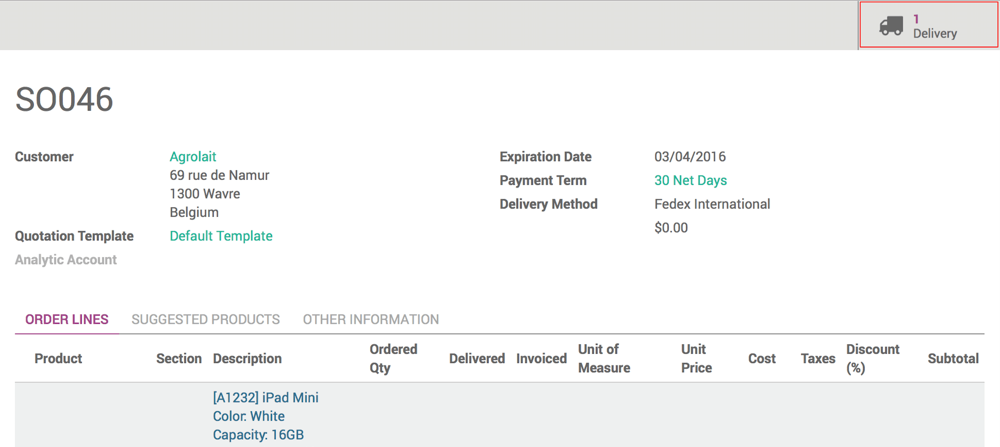

=================================
How do I cancel a delivery order?
=================================

Overview
========

Odoo gives you the possibility to cancel a delivery method whether it
has been validated to fast, it needs to be modified or for any other
reason.

Some carriers are more flexible than others, so make sure to cancel your
delivery order as fast as possible if it needs to be done so you don't
have any bad surprise.

Sale process
============

Go to the **Sales** module, click on **Sales** and then on **Sales
Order**. Then click on the sale order you want to cancel.

.. image:: media/cancel_order01.png
    :align: center

Click on the **Delivery** button, in the upper right corner of the sale
order.

Now, click on the **Additional info** tab and you will see that next to
the **Carrier Tracking Reference**, there is a **Cancel** button. Click
on it to cancel the delivery.

.. image:: media/cancel_order03.png
    :align: center

To make sure that your delivery is cancelled, check in the history, you
will receive the confirmation of the cancellation.

.. image:: media/cancel_order04.png
    :align: center
