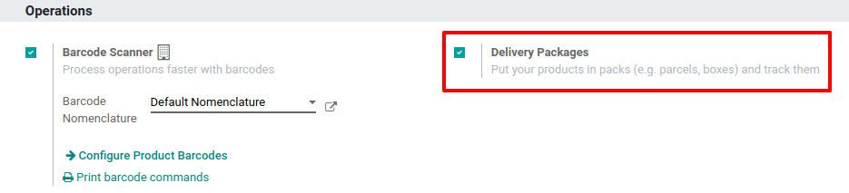
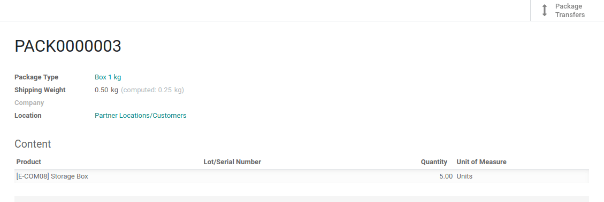
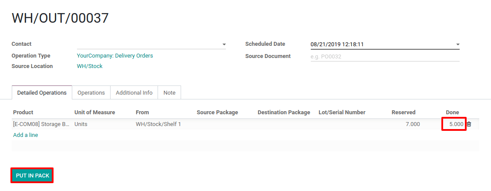

============================
Deliver Products in Packages
============================

In Odoo, you have the possibility to deliver your products in different
packages, depending on the volume and or weight of your products.

Configuration
=============

First, you need to activate the *Delivery Packages* feature in the
*Inventory app > Configuration > Settings*.

Proceed to a Delivery
=====================

Now, you can create a planned delivery with some products in it. You
will have the possibility to create new packages and assign them to the
stock move lines.

.. image:: media/packaging_type_02.png
    :align: center

Then, you can define the package type from this window. Once the
delivery order is validated, you can retrieve which products have been
included in the package.

.. image:: media/packaging_type_03.png
    :align: center

A button will appear at the delivery stage, allowing you to find all the
packages which were part of the delivery order.

.. image:: media/packaging_type_04.png
    :align: center

Use the Put in Pack button
==========================

Another way to put products in packs is to use the *Put in Pack*
button. It will automatically assign a pack to the number of products
which is set as *Done* and duplicate the stock move line if necessary.

Then, you will be able to update the different packages created this
way, directly via the *Packages* button.

.. image:: media/packaging_type_07.png
    :align: center