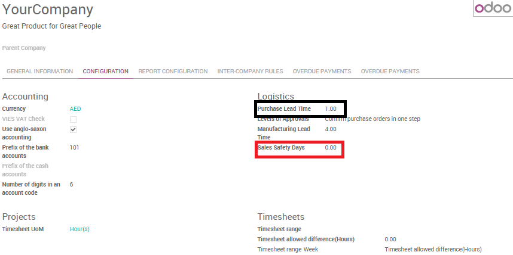

============================================
How is the scheduled delivery date computed?
============================================

Scheduled dates are computed in order to be able to plan deliveries,
receptions and so on. Depending on the habits of your company Odoo
automatically generates scheduled dates via the scheduler. The Odoo
scheduler computes everything per line, whether it's a manufacturing
order, a delivery order, a sale order, etc. The dates that are computed
are dependent on the different leads times configured in Odoo.

Configuring lead times
======================

Configuring **lead times** is a first essential move in order to compute
scheduled dates. Lead times are the delays (in term of delivery,
manufacturing, ...) promised to your different partners and/or clients.

Configuration of the different lead times are made as follows:

At a product level
------------------

-  **Supplier lead time**:

Is the time needed for the supplier to deliver your purchased product.
To configure the supplier lead time select a product, and go in the
**Inventory** tab. You will have to add a vendor to your product in order
to select a supplier lead time.

.. image:: media/scheduled_dates05.png
   :align: center

.. tip:: 
    Do not forget that it is possible to add different vendors and thus
    different delivery lead times depending on the vendor.

Once a vendor is selected, just open its form and fill its **Delivery lead
time**. In this case security days have no influence, the scheduled
delivery days will be equal to: **Date** of the purchase order + **Delivery
Lead Time**.

.. image:: media/scheduled_dates02.png
   :align: center

-  **Customer lead time**:

Customer lead time is the time needed to get your product from your
store / warehouse to your customer. It can be configured for any
product. Simply select a product, go into the sales tab and indicate
your **Customer lead time**.

.. image:: media/scheduled_dates01.png
   :align: center

-  **Manufacturing lead time**:

At the same page it is possible to configure the **Manufacturing Lead
Time** as well. Manufacturing lead time is the time needed to
manufacture the product.

.. tip::
    Don't forget to tick the manufacturing box in inventory if you
    want to create manufacturing routes.

At the company level
--------------------

At company level, it is possible to configure **security days** in order
to cope with eventual delays and to be sure to meet your engagements.
The idea is to subtract **backup** days from the **computed scheduled date**
in case of delays.

-  **Sales Safety days**:

Sales safety days are **back-up** days to ensure you will be able to
deliver your clients engagements in times. They are margins of errors
for delivery lead times. Security days are the same logic as the early
wristwatch, in order to arrive on time. The idea is to subtract the
numbers of security days from the calculation and thus to compute a
scheduled date earlier than the one you promised to your client. In that
way you are sure to be able to keep your commitment.

To set up your security dates, go to :menuselection:`Settings --> General settings` and
click on **Configure your company data**.

.. image:: media/scheduled_dates04.png
   :align: center

Once the menu is open, go in the configuration tab and indicate the
number of safety days.

-  **Purchase Safety days**:

Purchase days follow to the same logic than sales security days.

They are margins of error for vendor lead times. When the system
generates purchase orders for procuring products, they will be scheduled
that many days earlier to cope with unexpected vendor delays. Purchase
lead time can be found in the same menu as the sales safety days

.. tip::
    Note that you can also configure a default 
    Manufacturing lead time from here.

At route level
--------------

The internal transfers that a product might do due to the movement of
stocks can also influence the computed date.

The delays due to internal transfers can be specified in the **inventory**
app when creating a new push rule in a route.

Go to the push rules section on a route form to set a delay.

.. image:: media/scheduled_dates06.png
   :align: center

At sale order level:
--------------------

-  **Requested date**:

Odoo offers the possibility to select a requested date by the client by
indicating the date in the other information tab of the sales order.
If this date is earlier than the theoreticaly computed date odoo will
automatically display a warning.

.. image:: media/scheduled_dates07.png
   :align: center

Example
=======

As an example, you may sell a car today (January 1st), that is purchased
on order, and you promise to deliver your customer within 20 days
(January 20). In such a scenario, the scheduler may trigger the
following events, based on your configuration:

-  January 19: actual scheduled delivery (1 day of Sales Safety days)

-  January 18: receive the product from your supplier (1 day of Purchase
   days)

-  January 10: deadline to order at your supplier (9 days of supplier
   delivery lead time)

-  January 8: trigger a purchase request to your purchase team, since
   the team need on average 2 days to find the right supplier and
   order.
