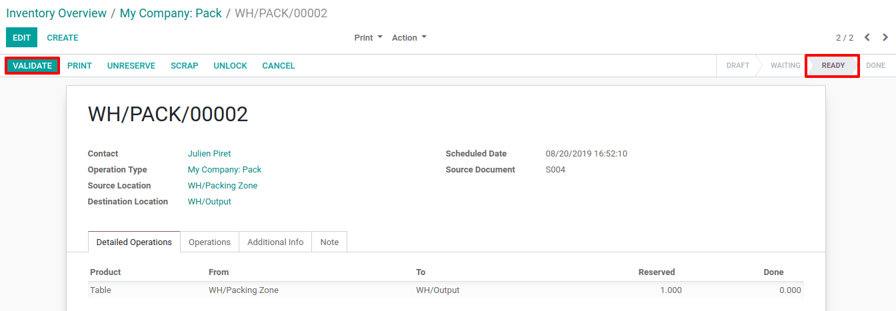
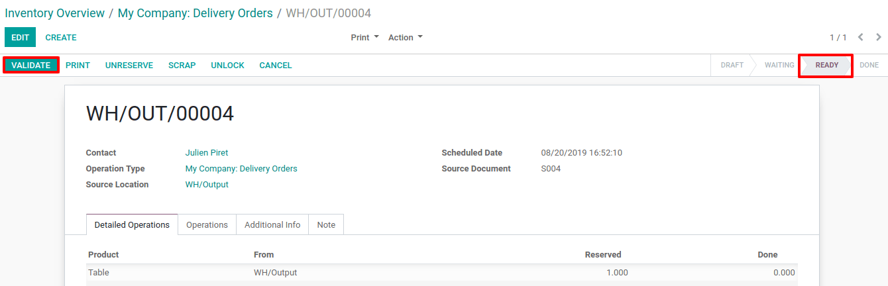

==========================================================
Process a Receipt in three steps (Input + Quality + Stock)
==========================================================

In many companies, it is necessary to assess the received good. The goal
is to check that the products correspond to the quality requirements
agreed with the suppliers. Therefore, adding a *quality control step*
in the goods receipt process can become essential.

Odoo uses routes to define exactly how you will handle the different
receipt steps. The configuration is done at the level of the warehouse.
By default, the reception is a one-step process, but changing the
configuration can allow having 3 steps.

The 3-steps flow is as follows: You receive the goods in an input area,
then transfer them into a quality area for *quality control*. When the
quality check has been processed, you can move the goods from QC to
stock. Of course, you may change the quantity and only transfer to stock
the quantity that is valid and decide that you will return the quantity
that is not good.

Multi-Step Routes
=================

First, you will need to activate the *multi-step routes* option.
Indeed, routes provide a mechanism to chain different actions together.
Here, we will chain the picking to the shipping.

To activate *multi-step routes*, open the *inventory app*, and go to
*Configuration > Settings* and activate the option. By default,
activating *multi-step routes* will also activate *Storage
Locations*.

.. image:: media/three_steps_01.png
    :align: center

Warehouse configuration
=======================

Now that *Multi-Step Routes* is activated, go to *Configuration >
Warehouse* and open the one you will use to deliver in 3 steps. Then,
you can select the option *Pack good, send goods in output and then
deliver (3 steps)* as *Outgoing Shipments*.

.. image:: media/three_steps_02.png
    :align: center

Activating this option will lead to the creation of two new locations,
*Output* and *Packing Zone*.

Of course, you can rename them if you want. To do so, go to
*Configuration > Locations* and select the one you want to rename.
Change its name and hit save.

Create a Sales Order
====================

In the *Sales* app, create a quotation with storable products to
deliver. Then, confirm it and three pickings will be created and linked
to your sale order.

.. image:: media/three_steps_03.png
    :align: center

Now, click on the button. You should see three different pickings:

-  The first one, with a reference PICK, designates the picking process;

-  The second one, with a reference PACK, is for the packing process;

-  The third one, with a reference OUT, designates the shipping process.

.. image:: media/three_steps_04.png
    :align: center

Process the picking, packing, and delivery
==========================================

The first operation to be processed is the picking and has a *Ready*
status, while the others are *Waiting Another Operation*. The packing
will become *Ready* as soon as the picking is marked as *Done*.

You can enter the picking operation from here, or access it through the
inventory app.

.. image:: media/three_steps_05.png
    :align: center

Note that, if you have the product in stock, it will be automatically
reserved and you can validate the picking document.

.. image:: media/three_steps_06.png
    :align: center

Now that the picking has been validated, the packing order is ready to
be processed. Since the documents are chained, the products that have
been picked are automatically reserved on the packing order so you can
directly validate it.

.. image:: media/three_steps_07.png
    :align: center

Then, you can validate your packing. In doing so, the delivery order can
be processed. Once again, it will be ready to be validated so you can
transfer the products to the customer location.

.. image:: media/three_steps_09.png
    :align: center

