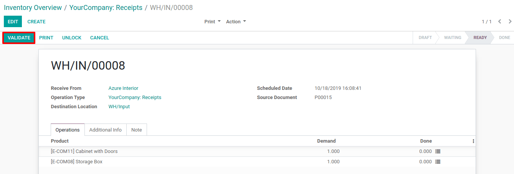
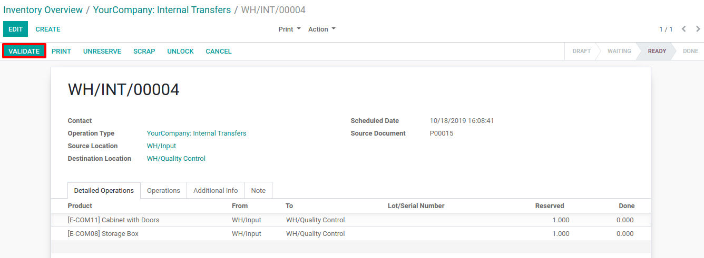

==========================================================
Process a Receipt in three steps (Input + Quality + Stock)
==========================================================

In many companies, it is necessary to assess the received good. The goal
is to check that the products correspond to the quality requirements
agreed with the suppliers. Therefore, adding a *quality control step*
in the goods receipt process can become essential.

Odoo uses routes to define exactly how you will handle the different
receipt steps. The configuration is done at the level of the warehouse.
By default, the reception is a one-step process, but changing the
configuration can allow having 3 steps.

The 3-steps flow is as follows: You receive the goods in an input area,
then transfer them into a quality area for *quality control*. When the
quality check has been processed, you can move the goods from QC to
stock. Of course, you may change the quantity and only transfer to stock
the quantity that is valid and decide that you will return the quantity
that is not good.

Multi-Step Routes
=================

First, you will need to activate the *multi-step routes* option.
Indeed, routes provide a mechanism to chain different actions together.
Here, we will chain the picking to the shipping.

To activate *multi-step routes*, open the *inventory app*, and go to
:menuselection:`Configuration --> Settings` and activate the option. By default,
activating *multi-step routes* will also activate *Storage
Locations*.

.. image:: media/three_steps_01.png
   :align: center

Warehouse configuration
=======================

Now that *Multi-Step Routes* is activated, go to :menuselection:`Configuration -->
Warehouse` and open the one you will use to deliver in 3 steps. Then,
you can select the option *Receive goods in input, then quality and then stock (3 steps)* as *Incoming Shipments*.

[UPDATE IMAGE]

Activating this option will lead to the creation of two new locations,
*Input* and *Quality Control*. 

Of course, you can rename them if you want. To do so, go to
:menuselection:`Configuration --> Locations` and select the one you want to rename.
Change its name and hit save.

Create a Purchase Order
====================

In the *Purchase* app, create a Requests for Quotation for storable products. Then, confirm it and one Receipt and two Internal Transfers will be created and linked to your purchase order.

[UPDATE IMAGE]

Now, click on the smart button Receipt. You will be redirected to the receipt order. The receipt order will be used to receive the goods in your input area.

The two Internal Transfers are accessible throught the inventory overview or, still in the inventory app, inside the Operations > Transfers menu. 

-  The first one is to transfer your goods into a quality area for quality control.

-  The second one will move the goods from quality control to stock after the quality check has been processed.

[UPDATE IMAGE]

Process the reception, the transfer to quality area and the final move to stock
==========================================

The first operation to be processed is the reception. The Internal Transfers are *Waiting Another Operation*. The Internal Tranfers to quality area will become *Ready* as soon as the reception is marked as *Done*.

You can enter the reception operation from here, or access it through the
inventory app.

[UPDATE IMAGE]

[UPDATE IMAGE]

Now that the reception has been validated, the first internal transfer is ready to
be processed. Since the documents are chained, the products that have
been received are automatically reserved on the internal transfer so you can
directly validate it.

[UPDATE IMAGE]

[UPDATE IMAGE]

Then, you can validate your internal transfert after you move your goods to the quality area. In doing so, the second internal transfert can now be processed. Once again, it will be ready to be validated after you've your quality check so you can finaly transfer the products into your stock.

[UPDATE IMAGE]

[UPDATE IMAGE]
.. image:: media/three_steps_10.png
   :align: center
