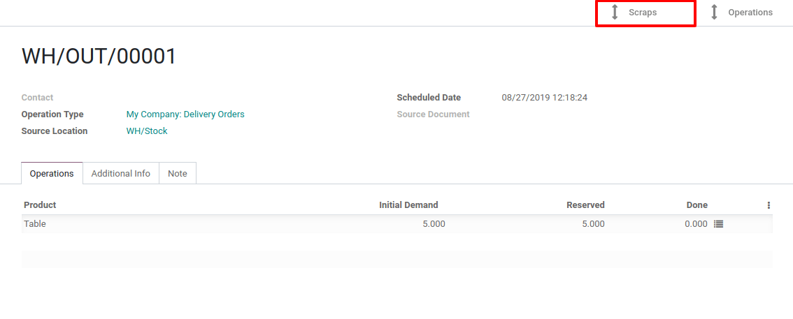

==============
Scrap Products
==============

In your warehouse, you sometimes find products that are damaged or that
are unusable due to expiry or for some other reasons. You often notice
this during picking or physical inventory. Since those products cannot
be sold or stored, you have to scrap them.

When goods are scrapped, they are not reflected in the system as a part
of the inventory. The scrapped material will be physically moved to the
scrap area and not taken into account into inventory valuation.

.. note::
         Scrap means waste that either has no economic value or only the value of
         its basic material content, recoverable through recycling.

Configuration
=============

When you install the *Inventory* app, Odoo automatically creates a
scrap location. It’s named *Virtual Location/Scap*.

Of course, you can create new scrap areas if needed. To do so, go to
*Inventory > Configuration > Settings* and activate the *Storage
Locations* feature.

.. image:: media/scrap_01.png
    :align: center

Now, go to *Configuration > Locations* and create your scrap location.

.. note::
         You have to check *Is a Scrap Location?* on the location form. In
         fact, scrap locations cannot be used as normal storage locations and
         then, a virtual location will be created for scrapped products.

Different ways to scrap products
================================

With Odoo, you have several ways to scrap products: from receipts, from
a delivery order, and from an internal transfer.

Scrap from receipt
------------------

Scrapping products from receipts is easy. Go to *Inventory > Dashboard
> Receipts* or click on *1 TO PROCESS* under the receipts location.

Now, open the receipt and validate the picking. Once the products
entered your stock, the Scrap button appears on the top left corner of
your screen.

You can scrap products that were part of the receipt from there. If you
do so, it will move them from available stock to the virtual scrap
location.

Scrap from delivery order
-------------------------

To scrap products from a delivery order, go to *Inventory > Dashboard >
Delivery orders* or click on *1 TO PROCESS*.

Once done, open the delivery order. You can see the scrap button in the
upper left of the document. If you scrap the product from there, it will
be moved from your available stock to the virtual scrap location.

You can find all the scrap orders made from the picking by clicking on
the button on the top right corner of the document.

Scrap from an internal transfer
-------------------------------

To do this, the flow is almost the same. In fact, you just have to go to
*Inventory > Dashboard > Internal Transfers*.

There, open the internal transfer that interests you. Now, click on the
scrap button that is on the top left of the document.

When scrapping before validating the internal transfer, the product is,
by default, moved from the source location to the virtual scrap
location. But, if you scrap after validating the internal transfer, it
will be moved from the destination location, as opposed to the source
location, to the virtual scrap location.

Of course, you can manually update the source location of the scrap
order if necessary.

