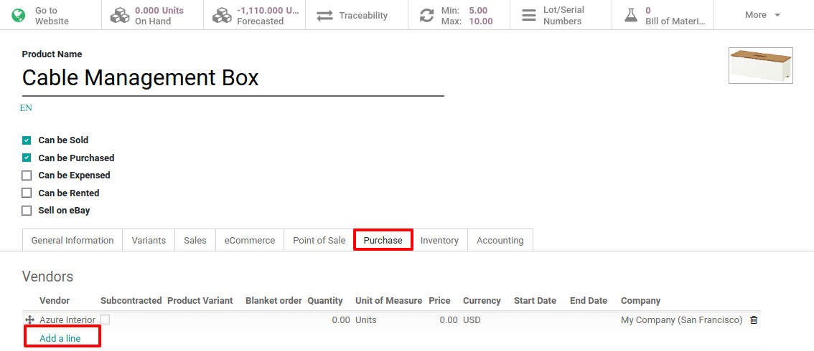
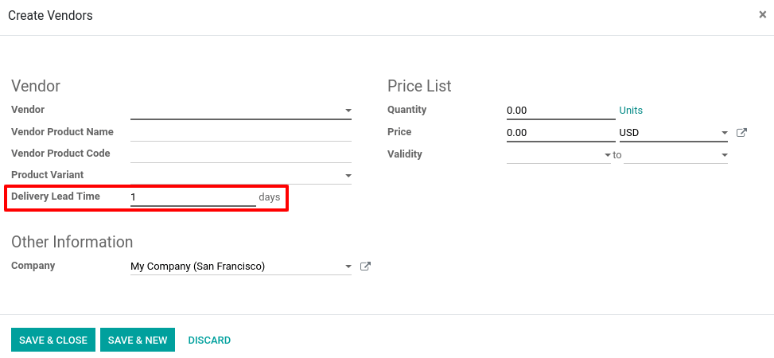
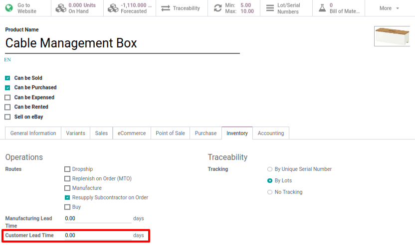
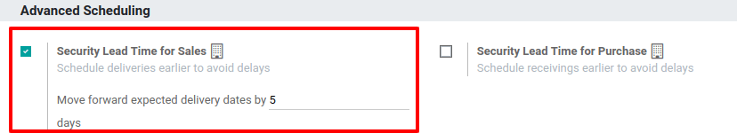
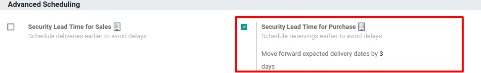
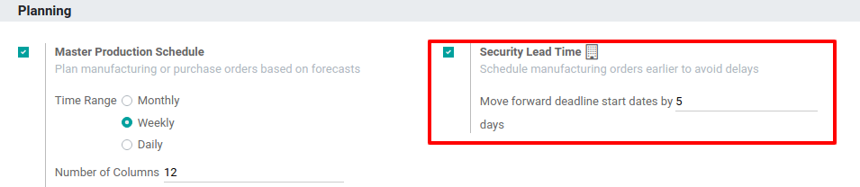
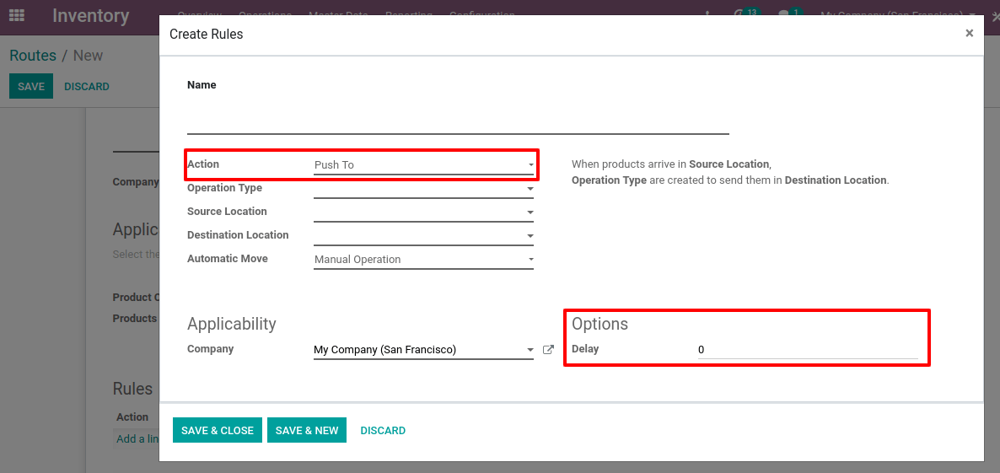
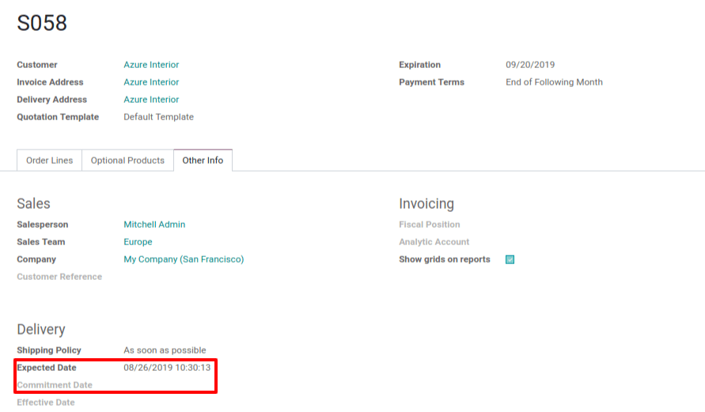
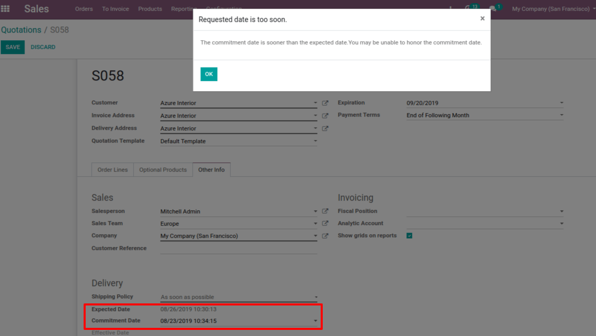

============================================
How is the Scheduled Delivery Date Computed?
============================================

In most cases, scheduled dates are computed to be able to plan
deliveries, receptions, and so on. Depending on your company’s habits,
Odoo generates scheduled dates via the scheduler.

To make your life easier, the Odoo scheduler computes everything per
line, whether it’s a manufacturing order, a delivery order, a sale
order, etc.

.. note::
        The computed dates are dependent on the different lead times configured
        in Odoo.

Configuring lead times
======================

Configuring lead times is the first move if you want to compute
scheduled dates. Those are the delays promised (in terms of delivery,
manufacturing, etc.) to your partners and/or clients.

.. note::
        In Odoo, you can configure different lead times.

At a product level
------------------

When configuring lead times at the product level, you have three
different types to take into account: supplier lead time, customer lead
time, and manufacturing lead time.

Supplier lead time
~~~~~~~~~~~~~~~~~~

The supplier lead time is the time needed for the supplier to deliver
your purchased products. To configure it, select a product and click on
the inventory tab. There, you will have to add a vendor to your product.

Now, just open the vendor form and fill its *Delivery lead time*. In
this case, the delivery day will be equal to *Date of the Purchase
Order + Delivery Lead Time*.

.. tip::
        Do not forget that it is possible to add different vendor pricelists
        and, thus, different delivery lead times, depending on the vendor.

Customer Lead Time
~~~~~~~~~~~~~~~~~~

It is the time needed to get your product from your store/warehouse to
your customer. It can be configured for any product. To add it, select a
product and go to the inventory tab. There, simply indicate your
*customer lead time*.

Manufacturing lead time
~~~~~~~~~~~~~~~~~~~~~~~

On the same page, it is possible to configure what’s called the
*Manufacturing Lead Time*. It is the time needed to manufacture the
product.

At the company level
--------------------

At the company level, you can configure security days. Those are useful
to cope with eventual dalys and to be sure to meet your engagements. The
idea is to subtract backup days from the computed scheduled date in case
of delays.

Once again, there are three different types of security lead times: for
sales, for purchases, and for manufacturing.

Security lead time for sales
~~~~~~~~~~~~~~~~~~~~~~~~~~~~

In sales, security lead time corresponds to backup days to ensure you
will be able to deliver your clients in times. They are margins of
errors for delivery lead times. Security days are the same logic as the
early wristwatch, in order to arrive on time.

The idea is to subtract the numbers of security days from the
calculation and, thus, to compute a scheduled date earlier than the one
you promised to your client. In that way, you are sure to be able to
keep your commitment.

To set up your security dates, go to :menuselection:`Inventory --> Configuration -->
Settings` and enable the feature.

Security lead time for purchase
~~~~~~~~~~~~~~~~~~~~~~~~~~~~~~~

It follows the same logic as security lead time for sales except that
security lead time for purchase is the margin of error for vendor lead
times, not for sales.

When the system generates purchase orders for procuring products, they
will be scheduled that many days earlier to cope with unexpected vendor
delays.

To find purchase lead time, go to :menuselection:`Inventory --> Configuration -->
Settings` and enable the feature.

Security lead time for manufacturing
~~~~~~~~~~~~~~~~~~~~~~~~~~~~~~~~~~~~

The security lead time for manufacturing allows generating manufacturing
orders which are scheduled that many days earlier to cope with
unexpected manufacturing days.

To configure it, go to :menuselection:`Manufacturing --> Configuration --> Settings` and
enable the *Security Lead Time* option. Then, hit save.

At route level
--------------

Sometimes, the internal transfers that a product might do may also
influence the computed date. The delays due to internal transfers can be
specified in the *Inventory* app when you create a new rule in a
route.

To specify them, go to :menuselection:`Inventory --> Configuration --> Routes` and add a
push rule to set a delay. Of course, you need to activate *Multi-step
Routes* to use this feature.

At the sale order level
-----------------------

Expected date
~~~~~~~~~~~~~

In the *Sales* application, you have the possibility to activate the
option *Delivery Date*. It will allow you to see additional fields on
the sale order.

By enabling this option, Odoo will indicate the *Expected Date* in the
*Other Info* tab of the sales order. This one is automatically
computed based on the different lead times.

If you set a *Commitment Date* to deliver your customer that is
earlier than the *Expected Date*, a warning message will appear on the
screen.

Example
~~~~~~~

To better understand all the above info, here is an example. You may
sell a car today (January 1st), that is purchased on order, and you
promise to deliver your customer within 20 days (January 20th). In such
a scenario, the scheduler will trigger the following events, based on
your configuration:

-  January 19: this is the actual scheduled delivery (1 day of Sales Safety Days);

-  January 18: you receive the product from your supplier (1 day of Purchase days);

-  January 10: this is the deadline to order at your supplier (9 days of Supplier Delivery Lead Time);

-  January 8: trigger a purchase request to your purchase team, since they need, on average, 2 days to find the right supplier and order.