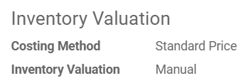
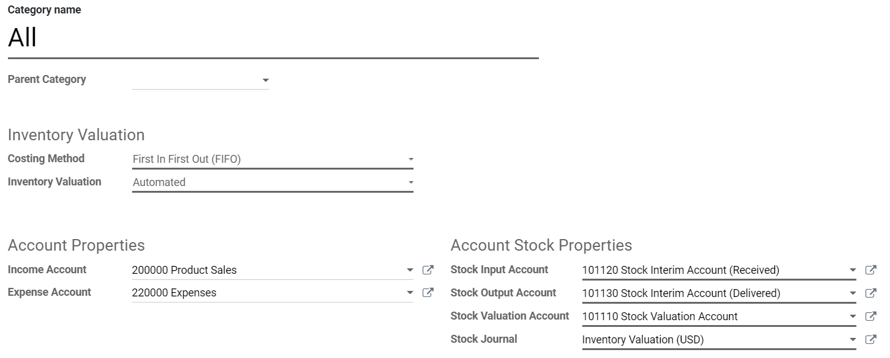

=================================
Inventory valuation configuration
=================================

Inventory valuation refers to how you value your stock. It’s a very
important aspect of a business as the inventory can be the biggest asset
of a company.

Inventory valuation implies two main choices:

-  The cost method you use to value your goods (standard, fifo, avco)
-  The way you record this value into your accounting books (manually or automatically)

Those two concepts are explained in the sections below.

Costing Methods: Standard, FIFO, AVCO
=====================================

The costing method is defined in the product category. There are three
options available. Each of them is explained in detail below.

Standard Price
--------------

In Standard Price, any product will be valued at a cost that you defined
manually on the product form. Usually, this cost is an estimation based
on the material and labor needed to obtain the product. This cost must
be reviewed periodically.

First In First Out (FIFO)
-------------------------

In FIFO, the products are valued at their purchase cost. When a product
leaves the stock, that’s the “First in, first out” rule that applies.
Let’s take an example: I first purchase a t-shirt for $10 and, later,
one for $20. The first t-shirt that will go out of my stock will be
valued at $10 and the next one at $20.

.. tip::
		Pay attention, that this is a financial FIFO. This means that the
		locations where the products are stored don’t impact the valuation. The
		first value “in” is the first value “out”, no matter the storage
		location.

Average Cost (AVCO)
-------------------

In AVCO, each product has the same value and this value is the average
purchase cost of the product. Let’s take an example: I first purchase a
t-shirt for $10 and, later, one for $20. Each t-shirt will be valued at
$15, the average weighted purchase cost. With this costing method, the
cost of the product is recomputed as each receipt.

Inventory Valuation: Manual or Automated
========================================

There are two ways to record your inventory valuation in your accounting
books. As the costing method, this is defined in your product category.
Those two methods are detailed below.

Manual Inventory Valuation
--------------------------

In this case, goods receipts and deliveries won’t have any direct impact
on your accounting books. Periodically, you create a manual journal
entry representing the value of what you have in stock. To know that
value, go in Inventory > Reporting > Inventory Valuation.

+----------------------------------+---------+----------+
|                                  | Debit   | Credit   |
+==================================+=========+==========+
| Assets: Inventory                | X       |          |
+----------------------------------+---------+----------+
| Expenses: Inventory Variations   |         | X        |
+----------------------------------+---------+----------+

.. tip::
		If the stock value has decreased, the assets account will be credited.

Automated Inventory Valuation
-----------------------------

In that case, when a product enters or leaves your stock, an accounting
entry will be automatically created. This means your accounting books
are always up-to-date. This mode is dedicated to expert accountants and
advanced users only. As opposed to periodic valuation, it requires some
extra configuration & testing.

First, you need to define the accounts that will be used for those
accounting entries. This is done on the product category.

Note that the accounting entries that will be recorded will depend on
your accounting mode: it can be continental or anglo-saxon. In
continental accounting, the cost of a good is taken into account as soon
as the product is received in stock. In anglo-saxon accounting, the cost
of a good is only recorded as an expense when this good is invoiced to a
final customer.

Usually, based on your country, the correct accounting mode will be
chosen by default. If you want to verify your accounting mode, activate
the developer mode and open your accounting settings.

.. seealso::
   * `How to do an inventory valuation? (Anglo-Saxon Accounting) <https://www.odoo.com/documentation/user/13.0/inventory/management/reporting/valuation_methods_anglo_saxon.html>`_
   * `How to do an inventory valuation? (Continental Accounting) <https://www.odoo.com/documentation/user/13.0/inventory/management/reporting/valuation_methods_continental.html>`_