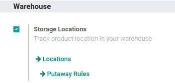
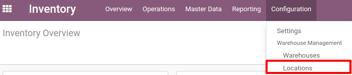
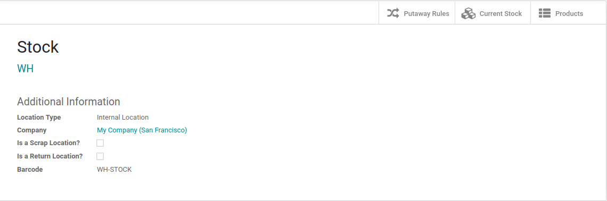

=====================
Create a New Location
=====================

Configuration
=============

In order to be able to create different locations, you will need to
activate *Multi-Locations* in the settings which can be done from the
:menuselection:`Inventory application --> Configuration --> Settings`.

In the *Inventory application*, you can now go to :menuselection:`Configuration -->
Locations` and hit *Create* in order to create a new location.

Type the name of the location in the *Location Name* field, and select
the *Parent Location* in the list. The parent location can be a
physical, partner or virtual location, and you can add as many
sub-locations as needed to a location.

In case you want the location to be suggested when creating a Return or
when Scrapping a product, you should check *Is a Scrap Location?* and
*Is a Return Location?*.

If you have the *Barcode* application installed, you can specify the
barcode which will correspond to this location.

.. note::
   A warehouse also corresponds to a location. As the locations are
   hierarchical, Odoo will create the parent location of the warehouse,
   containing all the sublocations in it.