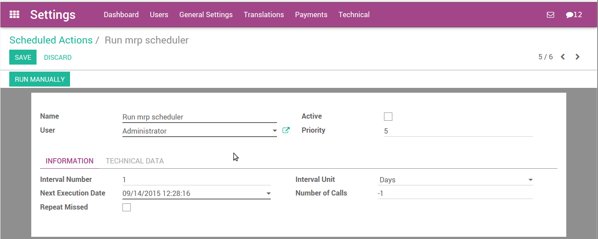

====================================
How to configure and run schedulers?
====================================

What is a scheduler
===================

The scheduler is the calculation engine which plans and prioritises
production and purchasing automatically according to the rules defined
on products. By default, the scheduler is set to run once a day (Odoo
automatically creates a **Scheduled Action** for this).

Calculating Requirements / Scheduling
-------------------------------------

Scheduling only validates procurements that are confirmed but not yet
started. These procurement reservations will themselves start
production, tasks or purchases depending on the configuration of the
requested product.

You take into account the priority of operations when starting
reservations and procurements. Urgent requests, those with a date in the
past, or requests with a date earlier than the others will be started
first. In case there are not enough products in stock to satisfy all the
requests, you can be sure that the most urgent requests will be produced
first.

Configure and run the scheduler
===============================

Run the scheduler manually
--------------------------

This feature is not visible by default. You have to enable **debug mode** to
see this. To enable debug mode, go to :menuselection:`Help --> About` and click on
**Activate the developer mode**.

You can also start the scheduler manually from the menu 
:menuselection:`Inventory --> Schedulers --> Run Schedulers`. The scheduler 
uses all the relevant parameters defined for products, suppliers 
and the company to determine the priorities between the different 
production orders, deliveries and supplier purchases.

.. image:: media/schedulers02.png
   :align: center

Configure and run the scheduler (only for advanced users)
---------------------------------------------------------

This feature is not visible by default. You have to enable **debug mode** to
see this. To enable debug mode, go to :menuselection:`Help -> About` and click on
**Activate the developer mode**.

You can set the starting time of the scheduler by modifying the
corresponding action in the menu 
:menuselection:`Settings --> Technical --> Automation --> Scheduled Actions`. 
Modify the Run mrp Scheduler configuration.

.. seealso::
    * :doc:`../delivery/scheduled_dates`