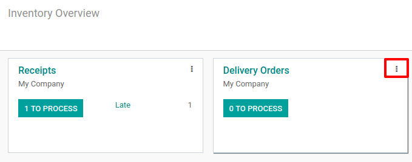
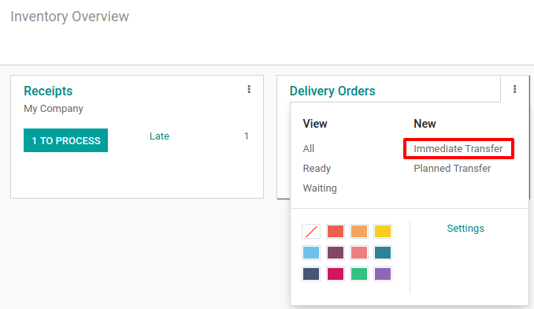
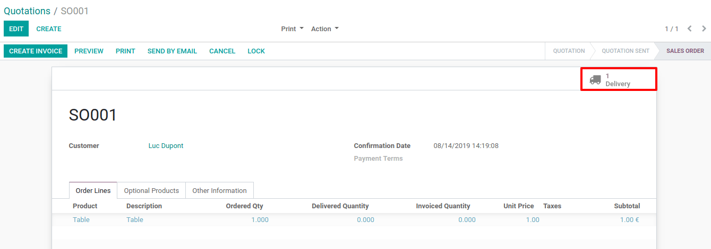

===========================
Deliver Products from Stock
===========================

Create Storable/Consumable Products
===================================

The first step to use the inventory application is to create products in
your database via the menu *Master Data > Products*. Click the Create
button and enter the name of your product.

.. image:: media/deliver_from_stock_01.png
    :align: center

In case you set the product as *storable*, you will track the stock
for this product and know how many units are in stock and what is the
forecasted number of units. If you want to include a product on
receipts/deliveries but don’t need to track its stock, you can set it as
*consumable*.

.. image:: media/deliver_from_stock_02.png
    :align: center

Deliver Products from Stock
===========================

Once you have existing products, you can decide to create a delivery to
deliver products to your customers. The process in order to do so is
described in the following print screens.

On the delivery order, you can specify to whom the products will be
delivered along with the different products and their respective
quantities. When the delivery is complete you can hit *Validate* and
the products will go out of your stock.

.. image:: media/deliver_from_stock_05.png
    :align: center

In case you have a delivery that is planned but shouldn’t be immediately
validated, you can create a *planned delivery* with a scheduled date
in the future. You can indicate the initial demand for each product,
corresponding to what has been ordered by your customer. Once the
document is filled in, you can hit “Mark as to do” in order to consider
it in your product forecasts.

.. image:: media/deliver_from_stock_06.png
    :align: center

Deliver Products from Stock from a Sale Order
=============================================

If you have the *Sales* application installed, delivery can be
directly created by *validating a quotation*. You will be able to find
the corresponding delivery directly on the *sale order*.

