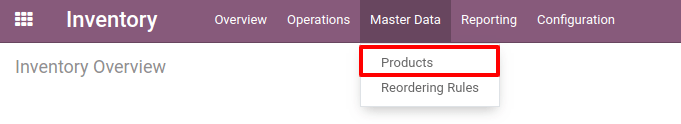
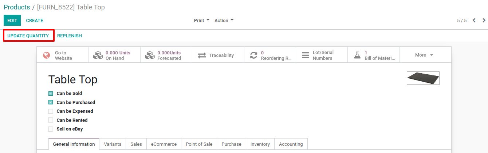
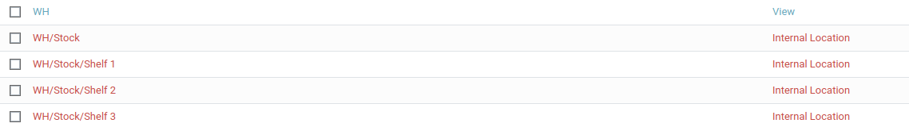

========================
Create Storable Products
========================

The first step to use the inventory application is to create products in
your database via the menu *Master Data > Products*. Click the Create
button and enter the name of your product.

Set the product as *storable*, in order to track the stock for this
product and be able to include it in an inventory adjustment.

.. image:: media/initial_stock_02.png
    :align: center

Set the product as *storable*, in order to track the stock for this
product and be able to include it in an inventory adjustment.

.. image:: media/initial_stock_02.png
    :align: center

Inventory Adjustment for Multiple Products
==========================================

Once you have created all your *storable products*, you can create an
*inventory adjustment* to determine their current stock level in Odoo.
You therefore need to go to *Operations > Inventory Adjustments* and
create a new one.

.. image:: media/initial_stock_03.png
    :align: center

You have to enter a title for your *inventory adjustment* and you can
then decide if you want to proceed to the *inventory adjustment* of
all products or only some of them. For a first *inventory adjustment*,
I suggest you to keep the *Products* field empty. You can then *Start
Inventory*.

.. image:: media/initial_stock_04.png
    :align: center

If you already have some products in stock, Odoo will add the lines with
the theoretical quantity currently in stock. You can also add new lines
with your other products.

.. image:: media/initial_stock_05.png
    :align: center

.. note::
         If your products are tracked by Serial/Lot numbers, you will have an
         additional column allowing you to specify those for the different units
         added to the inventory adjustment.

Odoo will highlight in red the lines for which there is a difference
between the theoretical quantity on hand, which is automatically
computed by the system, and the counted quantity you manually entered.
Once all the necessary products have been entered, you can hit
*Validate Inventory* and the quantities on hand of your different
products will be updated.

Inventory Adjustment for one Product
====================================

On each storable product, you have access to the *Update Quantity*
button.

When clicking this button, you see the current stock you have for this
product. You can edit the existing lines or create new ones to add stock
of your product in different locations and/or add new serial/lot
numbers.

.. image:: media/initial_stock_07.png
    :align: center

Once you come back to your product, you see that the quantity on hand as
been updated taking your modification into account.

.. image:: media/initial_stock_08.png
    :align: center

.. note::
         If you work with product variants, the quantity on hand will show you
         the total quantity in stock for the product template, taking the
         different variants into account.

By default, the quantity on hand of the product form will show you the
number of products that are part of your warehouse view location,
meaning which are part of an internal type sub-location of this
warehouse. It means that if you have any product in a location that
isn’t under the main warehouse location, they won’t appear in the stock
on hand stat button.

