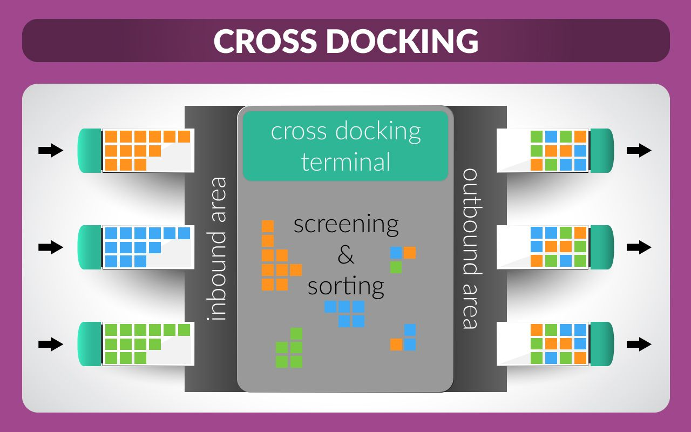
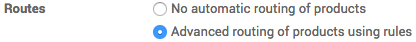
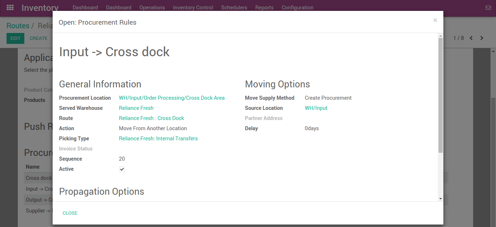

===============================================
How to organize a cross-dock in your warehouse?
===============================================

Cross dock area is temporarily area where we are not storing any product
instead just managing place according to delivery for further customer.
This will save lot of time for inter warehouse transfer and storing
process. We are managing our products with docking area where product
directly place from supplier location and transfer this to gate pass for
customer delivery.

.. note::

   For more information on how to organise your warehouse, read
   `What is cross docking and is it for me? <https://www.odoo.com/blog/business-hacks-1/post/what-is-cross-docking-and-is-it-for-me-270>`_

Configuration
=============

Warehouse and routes
--------------------

In the **Inventory** module, open :menuselection:`Configuration --> Settings -->
Location & Warehouse`, then in **Routes**, select **Advanced routing of
products using rules**, then click on **Apply**.

Open :menuselection:`Configuration --> Warehouse Management --> Warehouses`,
then open the warehouse you want to cross-dock from and click on **Edit**.

In the **Warehouse Configuration** tab, select:

- **Incoming Shipments**: Unload in input location then go to stock (2
  steps)

- **Outgoing Shipments**: Ship directly from stock (Ship only)

then click on **Save**.

.. image:: media/cross03.png
   :align: center

This steps has generated a cross-docking route that you can see in
:menuselection:`Inventory --> Configurations --> Routes --> Routes`.

Cross Docking Route
-------------------

We will use the route **Buy** for first part of the flow and create a route for
the remaining part:

.. image:: media/cross04.png
   :align: center

Each of the procurement rule will now be configured. Cross Dock location is
created as an internal physical location.

   :menuselection:`Input --> Cross Dock`

.. figure:: media/cross06.png
   :figclass: figure
   :align: center

   :menuselection:`Cross Dock --> Output`

.. figure:: media/cross07.png
   :figclass: figure
   :align: center

   :menuselection:`Output --> Customer`

Product with cross dock
-----------------------

We have created the Vegetable Fennel product and assigned the routes created above
as well as the **Buy** route.

We have also specified a supplier and a minimum order rule which is needed for
replenishment of a stockable product.

.. image:: media/cross08.png
   :align: center

.. seealso::

   * :doc:`use_routes`
   * :doc:`../../management/incoming/two_steps`