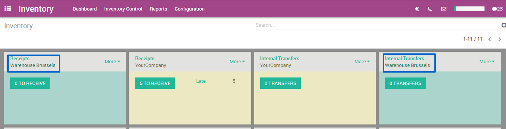
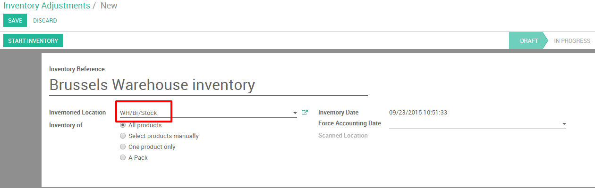
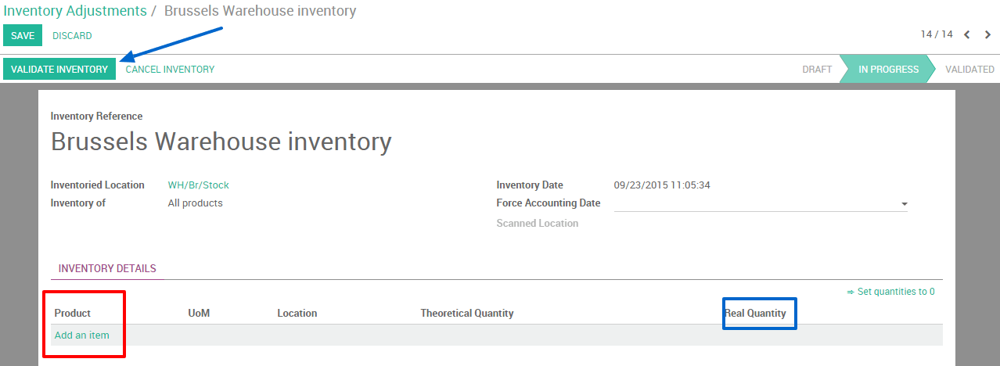

=====================================
How to do inter-warehouses transfers?
=====================================

If you own different warehouses you might want to transfer goods from
one warehouse to the other. This is very easy thanks to the inventory
application in Odoo.

Configuration
=============

First of all you have to select the multi locations option. Go to
:menuselection:`Configuration --> Settings` in the **Inventory application**.
Then tick the **Manage several locations per
warehouse** option. Please don't forget to **apply** your changes.

.. image:: media/inter01.png
   :align: center

.. tip::

	This option should also be ticked if you wish to manage different
	locations and routes in your warehouse.

Creating a new warehouse
========================

The next step is to create your new warehouse. In the Inventory application
click on :menuselection:`Configuration --> Warehouse Management --> 
Warehouses`. You are now able to create your warehouse by clicking on
**Create**.

Fill in a **Warehouse Name** and a **Short Name**. The short name is 5
characters maximum.

.. image:: media/inter02.png
   :align: center

.. tip::

	please note that the **Short Name** is very important as it will
	appear on your transfer orders and other warehouse documents. It might
	be smart to use an understandable one (e.g.: WH/[first letters of
	location]).

If you go back to your dashboard, new operations will automatically have
been generated for your new warehouse.

Creating a new inventory
========================

If you create a new warehouse you might already have an existing
physical inventory in it. In that case you should create an inventory in
Odoo, if not you can skip this step.

Go into the inventory application, select :menuselection:`Inventory Control -->
Inventory Adjustment`. You can then create a new inventory by clicking on
**Create**. Fill in the **Inventory Reference**, **Date**
and be sure to select the right warehouse and location.

Next, click on **Start Inventory**. A new window will open where you will
be able to input your existing products. Select add an item and indicate
the **Real Quantity** available in the warehouse. The theoretical quantity
can not be changed as it represents a computed quantity from purchase
and sales orders.

Don't forget to validate your inventory once you have recorder the state of
all yours product.

Create an internal transfer
===========================

The final step is to create your internal transfer. If you want to
tranfer 2 units of a product from your first warehouse to another one in
Brussels, proceed as follows:

From your dashboard, select a internal movement of one of the two
warehouses. To do so, click on :menuselection:`More  --> Transfer`.

.. image:: media/inter06.png
   :align: center

A new window will open where you will be able to select the source
location zone (in this case our "old warehouse") and the destination
location zone (in this case our "new" warehouse located in Brussels).

Add the products you want to transfer by clicking on **Add an Item** and
don't forget to **Validate** or **Mark as TODO** once you are done.

.. image:: media/inter07.png
   :align: center

If you select **Validate**, Odoo will process all quantities to transfer.

If you select **Mark as TODO**, Odoo will put the transfer in **Waiting
Availability** status. Click on **Reserve** to reserve the amount of
products in your source warehouse.

It is also possible to manually transfer each product:

1. Via your dashboard, select the transfer order in the source location.

   .. image:: media/inter08.png
	  :align: center

2. Select the right transfer order

   .. image:: media/inter09.png
      :align: center

3. Click on the little pencil logo in the lower right
corner in order to open the operation details window. In this new
window you can manually indicate how much products you process

.. image:: media/inter10.png
   :align: center

.. tip::

	If you decide to partially process the transfer order (e.g. a part of the
	products can't be shipped yet due to an unexpected event), Odoo will
	automatically ask if you wish to create a **backorder**.
	Create a backorder if you expect to process the remaining products
	later, do not create a backorder if you will not supply/receive the
	remaining products.
