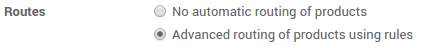

===========================
What is a procurement rule?
===========================

Overview
========

The procurement inventory control system begins with a customer's order.
With this strategy, companies only make enough product to fulfill
customer's orders. One advantage to the system is that there will be no
excess of inventory that needs to be stored, thus reducing inventory
levels and the cost of carrying and storing goods. However, one major
disadvantage to the pull system is that it is highly possible to run
into ordering dilemmas, such as a supplier not being able to get a
shipment out on time. This leaves the company unable to fulfill the
order and contributes to customer dissatisfaction.

An example of a pull inventory control system is the make-to-order. The
goal is to keep inventory levels to a minimum by only having enough
inventory, not more or less, to meet customer demand. The MTO system
eliminates waste by reducing the amount of storage space needed for
inventory and the costs of storing goods.

Configuration
=============

Procurement rules are part of the routes. Go to the Inventory
application>Configuration>Settings and tick "Advance routing of products
using rules".

Procurement rules settings
==========================

The procurement rules are set on the routes. In the inventory
application, go to Configuration > Routes.

In the Procurement rules section, click on Add an item.

.. image:: media/procurement_rule02.png
    :align: center

Here you can set the conditions of your rule. There are 3 types of
action possible :

-   Move from another location rules

-   Manufacturing rules that will trigger the creation of manufacturing
    orders

-   Buy rules that will trigger the creation of purchase orders

.. note:: 
    The Manufacturing application has to be installed in order to
    trigger manufacturing rules.

.. note:: 
    The Purchase application has to be installed in order to trigger
    **buy** rules.

.. image:: media/procurement_rule03.png
    :align: center

.. demo:action:: stock.action_routes_form
    
    Try to create a procurement rule in our demo instance. 

.. note:: 
    Some Warehouse Configuration creates routes with procurement
    rules already defined.

.. seealso::
    * :doc:`push_rule`
    * :doc:`inter_warehouse`
    * :doc:`cross_dock`
