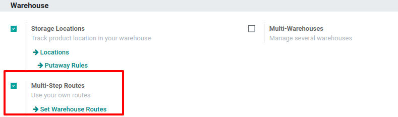
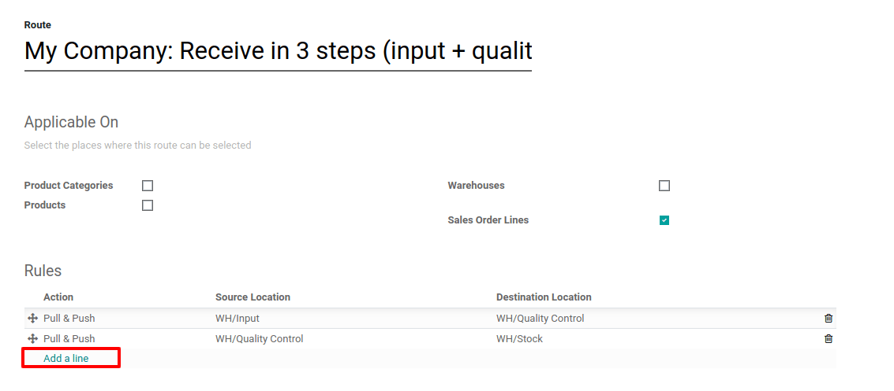
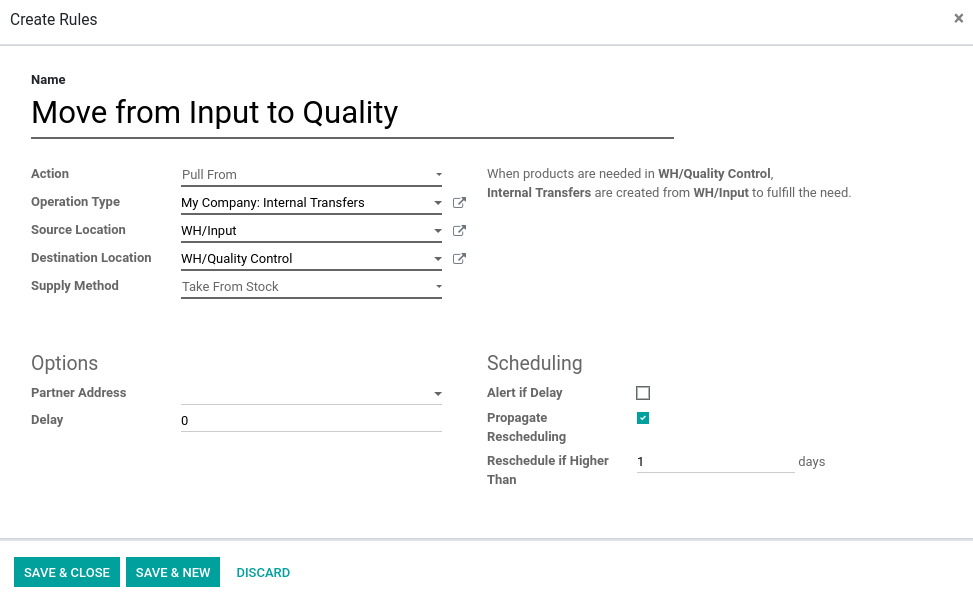

===========================
What are Pull & Push Rules?
===========================

In inventory management, the supply chain strategy determines when
products should be fabricated, delivered to distribution centers and
made available in the retail channel.

Under a pull supply chain, actual customer demand drives the process,
while push strategies are driven by long-term projections.

Pull Inventory Control System
=============================

The *procurement inventory control system* begins with a customer's
order. With this strategy, companies only produce enough to fulfill their
customer's orders. One advantage is that there are no
extra goods that need to be stored, thus reducing inventory levels
and the cost of carrying and storing. However, one major
disadvantage to the pull system is that it is highly possible to run
into ordering dilemmas, such as a supplier not being able to get a
shipment out on time. This leaves the company unable to fulfill the
order and contributes to customer dissatisfaction.

An example of a pull inventory control system is the make-to-order. The
goal is to keep inventory levels to a minimum by only having enough
inventory to meet customer's demand. The :abbr:`MTO (Make-to-order)` system
eliminates waste by reducing the amount of storage space needed for
inventory and the costs of storing goods.

Push Inventory Control System
=============================

The *push system of inventory control* involves forecasting inventory
needs to meet customer's demand. Companies must predict which products
customers will purchase along with determining what quantity of goods
will be purchased. The company will, in turn, produce enough product to
meet the forecast demand and sell, or push, the goods to the consumer.
Disadvantages of the push inventory control system are that forecasts
are often inaccurate as sales can be unpredictable and vary from one
year to the next, but it also increases the company's costs for storing
these goods if the minimum stock isn’t well defined. An advantage of the push system is that the
company is fairly assured it will have enough product on hand to complete customer orders,
preventing the inability to meet customer demand for the product.
  
A push flow indicates how locations are chained with other ones. As soon
as a given quantity of products is moved in the source location, a
chained move is automatically foreseen according to the parameters set
on the flow specifications (destination location, delay, type of move).
It can be triggered automatically or manually.

Configuration
=============

Pull and push rules are part of the routes. Go to :menuselection:`Inventory --> Configuration -->
Settings` and tick *Multi-Step Routes*.

.. Note::
   Storage Locations are automatically activated at the same time as
   Multi-Step Routes.

Rules settings
==============

The rules are defined on the routes. In the inventory application, go to
:menuselection:`Inventory --> Configuration --> Routes`. In the *Rules* section, click on *Add a line*.

Here you can set the action to be triggered by the rule. Choose from:

- **Pull From**: this rule will be triggered by a need for the product in a specific stock
  location. The need can come from a sale order which has been validated or for a manufacturing order
  which requires a specific component. When the need appears in the source location, Odoo generates a
  picking to fulfill this need thanks to the pull rule.
- **Push To**: this rule will be triggered by the arrival of some products in the defined source
  location. In case you move products to the source location, Odoo generates a picking to move those
  products to the destination location.
- **Push & Pull**: it allows to generate a picking in the two different situations explained above,
  when products are required in a specific source location as well as when they are pushed to a
  specific source location.
- **Buy**: when products are needed the source location, a request for quotation is created to
  fulfill the need.
- **Manufacture**: when products are needed in the source location, a manufacturing order is
  created to fulfill the need.
- Many translated example sentences containing

The *Operation Type* allows you to define which kind of picking will
be created from this rule, in the example, I would like to create an
internal transfer.
The *Supply Method* allows you to define what happens at the source
location:

- **Take From Stock**: the products will be taken from the available stock of the source location.
- **Trigger Another Rule**: the system will try to find a stock rule to bring the products in the
  source location. The available stock will be ignored.
- **Take From Stock, if Unavailable, Trigger Another Rule**: the products will be taken from the
  available stock of the source location. If there is no stock available, the system will try to find
  a rule to bring the products in the source location.

In the *Scheduling* section, you can determine how will Odoo behave
when one of the pickings of the chain is rescheduled. In case you decide
to Propagate Rescheduling, the next move will also be rescheduled. In
case you prefer to have the choice to manually reschedule the next move
or not, you can decide to receive an alert about it under the form of
the next activity.