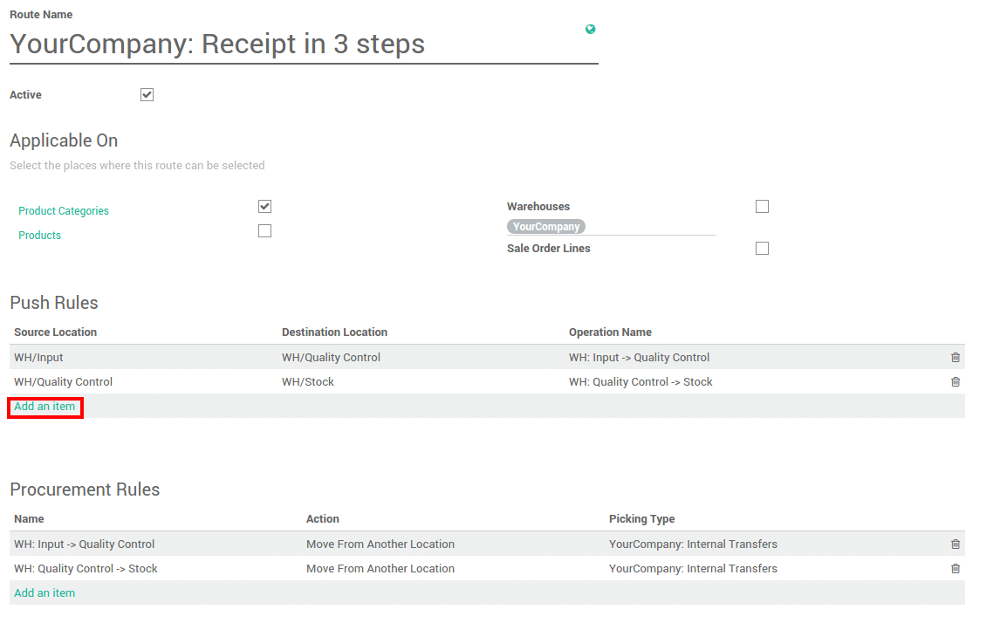

====================
What is a push rule?
====================

Overview 
=========

The push system of inventory control involves forecasting inventory
needs to meet customer demand. Companies must predict which products
customers will purchase along with determining what quantity of goods
will be purchased. The company will in turn produce enough product to
meet the forecast demand and sell, or push, the goods to the consumer.
Disadvantages of the push inventory control system are that forecasts
are often inaccurate as sales can be unpredictable and vary from one
year to the next. Another problem with push inventory control systems is
that if too much product is left in inventory, this increases the
company's costs for storing these goods. An advantage to the push system
is that the company is fairly assured it will have enough product on
hand to complete customer orders, preventing the inability to meet
customer demand for the product.

A push flow indicates how locations are chained with the other ones. As
soon as a given quantity of products is moved in the source location, a
chained move is automatically foreseen according to the parameters set
on the flow specification (destination location, delay, type of move,
journal). It can be triggered automatically or manually.

Configuration
=============

Push rules are part of the routes. Go to the menu 
:menuselection:`Inventory --> Configuration --> Settings` 
and tick **Advance routing of products using rules**.

.. image:: media/push_rule01.png
    :align: center

Push rules settings
===================

The push rules are set on the routes. 
Go to :menuselection:`Configuration --> Routes`.

In the push rule section, click on **Add an item**.

Here you can set the conditions of your rule. In this example, when a
good is in **Input location**, it needs to be moved to the quality control.
In the 3 steps receipts, another push rule will make the goods that are
in the quality control location move to the stock.

.. image:: media/push_rule03.png
    :align: center

.. demo:action:: stock.action_routes_form
    
    Try to create a push rule in our demo instance. 

.. note::
    Some warehouse configuration creates routes with push rules
    already defined.

Stock transfers
===============

The push rule will trigger stock transfer. According to the rule set on
your route, you will see that some transfers might be ready and other
are waiting.

The push rule that was set above will create moves from **WH/Input**
location to the **WH/Quality Control** location.

.. image:: media/push_rule04.png
    :align: center

In this example, another move is waiting according to the second push
rule, it defines that when the quality control is done, the goods will
be moved to the main stock.

.. seealso::
    * :doc:`procurement_rule`
    * :doc:`inter_warehouse`
    * :doc:`cross_dock`
