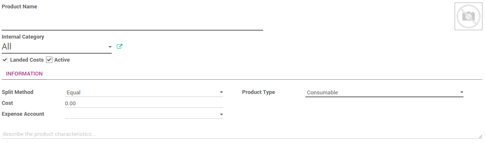

=========================================================
How to integrate landed costs in the cost of the product?
=========================================================

Overview
========

Landed costs include all charges associated to a good transfer.

Landed cost includes = Cost of product + Shipping + Customs + Risk

All of these components might not be applicable in every shipment, but
relevant components must be considered as a part of the landed cost. We
have to identify landed cost to decide sale price of product because it
will impact on company profits.

Configuration
=============

Applications configuration
--------------------------

First, you need to activate the use of the landed costs. Go to
:menuselection:`Inventory application --> Configuration --> Setting`. 
Check accounting option **Include landed costs in product costing computation**
& **Perpetual inventory valuation**, then click on **Apply** to save
changes.

.. image:: media/landed_costs01.png
    :align: center

Then go to the :menuselection:`Purchase application --> Configuration --> Setting`.
Choose costing method **Use a 'Fixed', 'Real' or 'Average' price
costing method**, then click on **Apply** to save changes.

.. image:: media/landed_costs02.png
    :align: center

Landed Cost Types
-----------------

Start by creating specific products to indicate your various **Landed
Costs**, such as freight, insurance or custom duties. Go to 
:menuselection:`Inventory --> Configuration --> Landed Cost types`.

.. demo:fields:: stock_landed_costs.stock_landed_cost_type_action

.. note:: 
    Landed costs are only possible for products configured in real
    time valuation with real price costing method. The costing method is
    configured on the product category.

Link landed costs to a transfer
===============================

To calculate landed costs, go to 
:menuselection:`Inventory --> Inventory Control --> Landed Costs`.

Click on the **Create** button and select the picking(s) you want to
attribute landed costs.

.. image:: media/landed_costs04.png
    :align: center

Select the account journal in which to post the landed costs. We
recommend you to create a specific journal for landed costs. Therefore
it will be easier to keep track your postings.

.. image:: media/landed_costs05.png
    :align: center

Click the **Compute** button to see how the landed costs will be split
across the picking lines.

To confirm the landed costs attribution, click on the **Validate** button.
