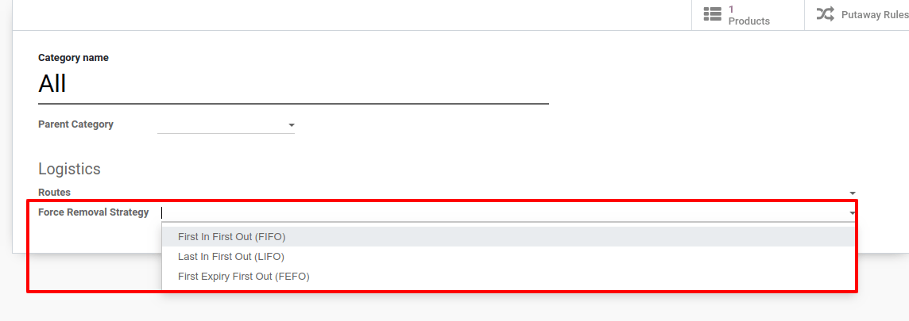
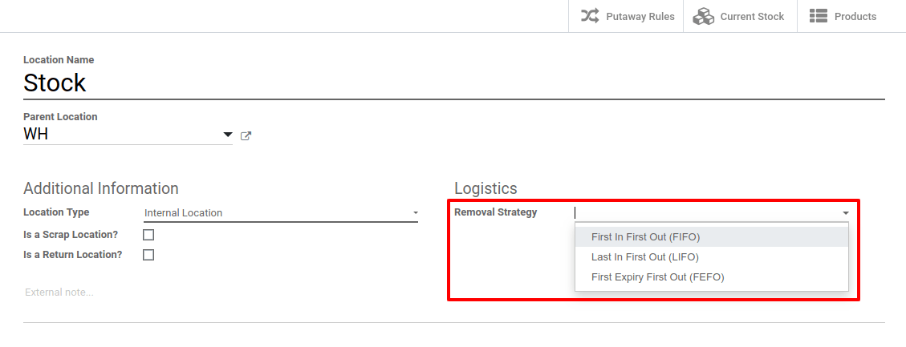
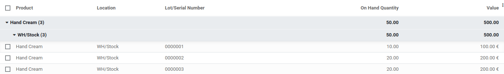
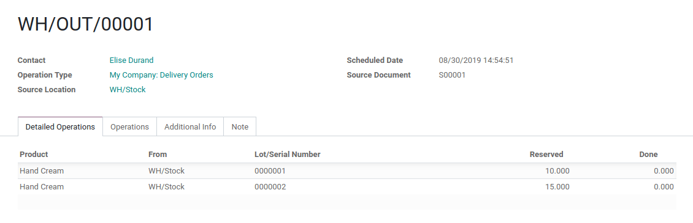

==================================================
What is a Removal Strategy (FIFO, LIFO, and FEFO)?
==================================================

Removal strategies are a set of rules defined in picking operations that change which products
are moved first. A removal strategy can optimize the distance for the worker, for
quality control purposes or to first move the products with the closest
expiration date.

When a product movement needs to be done, Odoo will find available
products that can be assigned to the transfer. The way Odoo assigns
these products depends on the *removal strategy* that is defined in
the *product category* or on *the location*.

Configuration
=============

In order to be able to identify some units from other ones, in Odoo, you
need to track them either by lot or by serial number. Go to 
:menuselection:`Inventory --> Configuration --> Settings`.

Activate *Storage Locations*, *Multi-Step Routes* and *Lots &
Serial Numbers*.

.. image:: media/removal_01.png
   :align: center
   :alt: Enabling lots and serial numbers to use FIFO, LIFO and FEFO strategies

In case you want to work with FEFO, *Expiration Dates* should also be
activated.

You can then define your removal strategy, either on *Product
Categories* via the :menuselection:`Inventory --> Configuration --> Product
Categories`, or on *Locations*, in :menuselection:`Inventory -->
Configuration --> Locations`.

Removal Strategy Types
======================

FIFO (First In First Out)
-------------------------

A First In First Out strategy implies that the products that were
stocked first are moved out first. Companies should use the FIFO method
if they are selling perishable goods. Companies selling products with
relatively short demand cycles, such as clothes, also may have to pick
FIFO to ensure they are not stuck with outdated styles in inventory.

Go to :menuselection:`Inventory > Configuration > Locations`, open the Stock location and
set FIFO as the removal strategy.

In your stock location (WH/Stock), there are 3 lots of Hand Cream
available.

Create a sales order for 25 units of Hand Cream and validate it. If you
go on the delivery order linked to the picking, you can see that the
oldest lot numbers have been automatically reserved thanks to the FIFO
removal strategy.

LIFO (Last In First Out)
------------------------

In LIFO, the products which are brought the last move out the first.
LIFO is used when products do not have a shelf life.

Go to :menuselection:`Inventory --> Configuration --> Locations`, open the location WH/Stock
and set the LIFO removal strategy. With the exact same data in the
database, we can now see that on the picking, the lot numbers which are
privileged are the ones created the last.

FEFO (First Expiry First Out)
-----------------------------

In FEFO warehouse management, the products are dispatched from the
warehouse according to their expiration date.

In case you want more information about Expiration Dates, please have a
look at :doc:`manage expiration dates <../../management/lots_serial_numbers/expiration_dates>` documentation.

The activation of the *Expiration Dates* functionality allows you to
define different dates on the serial/lot numbers, which are used in
FEFO. These dates can be set from :menuselection:`Inventory --> Master Data --> Lots/Serial
Numbers`.

.. image:: media/removal_07.png
   :align: center
   :alt: View of removal date when using a FEFO strategy

Lots are picked based on their removal date, from earliest to
latest. Lots without a removal date defined are picked after lots
with removal dates.

All dates except *removal dates* are for informational and reporting
purposes only. Lots that are past any or all of the above expiration
dates may still be picked for delivery orders.

To set the removal strategy on location, go to :menuselection:`Inventory --> Configuration -->
Locations`, open WH/Stock and choose FEFO.

+-----------------------+---------------+-----------------------+
| **Lot / Serial No**   | **Product**   | **Expiration Date**   |
+=======================+===============+=======================+
| 0000001               | Hand Cream    | 09/30/2019            |
+-----------------------+---------------+-----------------------+
| 0000002               | Hand Cream    | 11/30/2019            |
+-----------------------+---------------+-----------------------+
| 0000003               | Hand Cream    | 10/31/2019            |
+-----------------------+---------------+-----------------------+

When we sell for 25 units of Hand Cream, we can see that the
lot numbers which have been automatically reserved by Odoo are the ones
with the closest expiration date, meaning 0000001 and 0000003.

.. image:: media/removal_08.png
   :align: center
   :alt: View of which lots are reserved when using a FEFO strategy